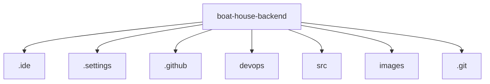

# 基础信息

|      |      |
|------|------|
| 编码语言 | .java |
| 代码路径 | boat-house-backend |
| 概述说明 | ResponseData封装响应数据，User管理用户信息，登录注册接口实现安全认证，用户管理接口增删改查，UserService管理User实体，Swagger生成API文档，JwtUtil处理JWT，Spring Boot配置MyBatis，MavenWrapper统一构建环境，JdbcUtils简化数据库操作，控制器处理多种功能，BaseController定义状态码，实体类描述各类数据，工具类提供辅助功能，BaseDao简化SQL执行，服务类管理数据，Swagger启用API文档生成。 |

# 说明

ResponseData类封装响应数据，简化处理。User类包含用户信息，确保完整性。登录注册接口类实现安全认证。用户管理接口提供增删改查功能。UserService类管理User实体，实现职责分离。Swagger配置类定义API文档，JwtUtil类简化JWT操作。Spring Boot配置MyBatis映射器扫描，提升可维护性。MavenWrapperDownloader类下载maven-wrapper.jar，统一构建环境。JdbcUtils类简化数据库操作。多个控制器处理加盟、船坞故事、菜品等功能。BaseController定义状态码和封装结果。多个实体类描述订单项、食品类别等。工具类提供日期格式化、异常处理等功能。BaseDao封装SQL执行，简化数据库交互。Spring Boot启动类扫描Mapper包并启动应用。多个服务类管理订单、页面等数据。Swagger配置类启用Swagger2，自动生成API文档。

### 包内部结构视图

该流程图展示了 `boat-house-backend` 项目的主要目录结构。根目录下包含了多个子目录和文件，如 `.ide`、`.settings`、`.github`、`devops`、`src`、`images` 和 `.git`。这些子目录和文件分别用于存储项目的开发环境配置、设置、GitHub 相关配置、运维脚本、源代码、图片资源以及 Git 版本控制信息。

# 文件列表 File List

| 名称   | 类型  | 说明 |
|-------|------|-------------|
| [_module.md](src/product-service/api/src/main/java/com/_module.md) | folder | ResponseData封装响应数据，User管理用户信息，登录注册接口实现安全认证，用户管理接口增删改查，UserService管理User实体，Swagger生成API文档，JwtUtil处理JWT，Spring Boot配置MyBatis，MavenWrapper统一构建环境，JdbcUtils简化数据库操作，控制器处理多种功能，BaseController定义状态码，实体类描述各类数据，工具类提供辅助功能，BaseDao简化SQL执行，服务类管理数据，Swagger启用API文档生成。 |

