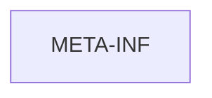

# 基础信息

|      |      |
|------|------|
| 编码语言 | .java |
| 代码路径 | boat-house-backend/src/account-service/api/src/main/java/META-INF |
| 包名 | boat-house-backend.src.account-service.api.src.main.java.META-INF |
| 概述说明 | None |

# 说明

None

### 包内部结构视图

描述：该流程图展示了路径 `boat-house-backend/src/account-service/api/src/main/java/META-INF` 的层级关系。由于路径只有一个节点，即 `META-INF`，因此图中仅包含该节点，没有进一步的子节点或分支。

# 文件列表 File List

| 名称   | 类型  | 说明 |
|-------|------|-------------|

