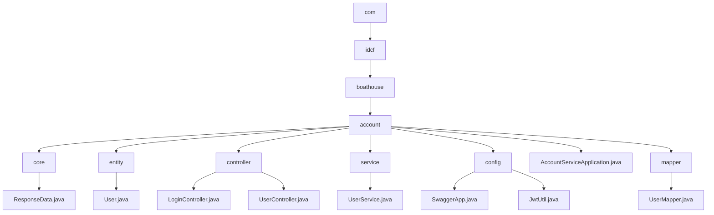

# 基础信息

|      |      |
|------|------|
| 编码语言 | .java |
| 代码路径 | boat-house-backend/src/account-service/api/src/main/java/com |
| 包名 | boat-house-backend.src.account-service.api.src.main.java.com |
| 概述说明 | ResponseData类封装响应信息，User类管理用户数据，登录注册接口实现用户认证，UserService类处理业务逻辑，Swagger配置API文档，JwtUtil管理JWT，MyBatis映射器简化数据库交互。 |

# 说明

ResponseData类用于封装响应数据，包含成功标志、状态码、消息和数据属性，提供默认信息和构造方法，简化响应处理。User类包含id、account、age、email和password属性，确保用户信息的完整性和唯一性。登录注册接口类实现用户登录和注册功能，提供安全认证机制。用户管理接口实现增删改查功能，高效管理用户数据。UserService类继承ServiceImpl，利用UserMapper管理User实体，实现职责分离和代码复用。Swagger配置类定义API文档信息，JwtUtil类简化JWT生成和验证。Spring Boot配置MyBatis映射器扫描，确保正确识别和加载映射器接口，提升应用可维护性。

### 包内部结构视图

该流程图展示了 `boat-house-backend` 项目中 `account-service` 模块的目录结构。从根目录 `com` 开始，逐级展开到 `idcf`、`boathouse` 和 `account`，并在 `account` 下细分为多个子目录和文件，如 `core`、`entity`、`controller`、`service`、`config` 和 `mapper`，每个子目录下包含具体的 Java 文件。

# 文件列表 File List

| 名称   | 类型  | 说明 |
|-------|------|-------------|
| [idcf](idcf/_module.md) | package | ResponseData类封装响应信息，User类管理用户数据，登录注册接口实现用户认证，UserService类处理业务逻辑，Swagger配置API文档，JwtUtil管理JWT，MyBatis映射器简化数据库交互。 |

