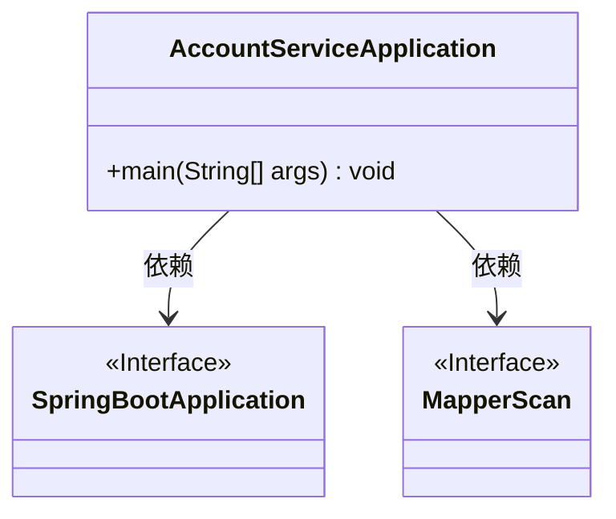
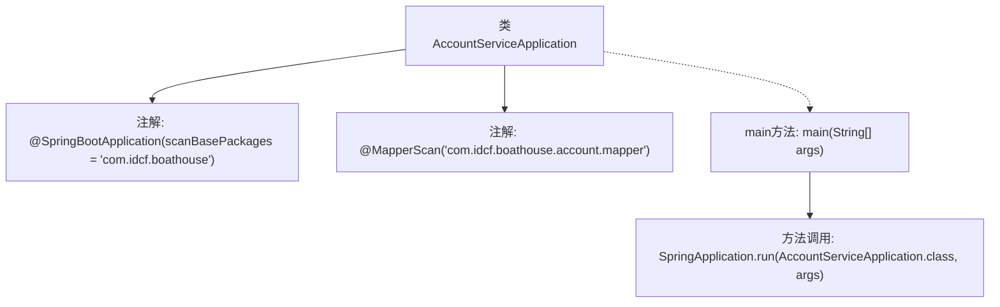

# 基础信息

|      |      |
|------|------|
| 编码语言 | .java |
| 代码路径 | boat-house-backend/src/account-service/api/src/main/java/com/idcf/boathouse/account/AccountServiceApplication.java |
| 包名 | com.idcf.boathouse.account |
| 依赖项 | ['org.mybatis.spring.annotation.MapperScan', 'org.springframework.boot.SpringApplication', 'org.springframework.boot.autoconfigure.SpringBootApplication'] |
| 概述说明 | Spring Boot应用配置MyBatis映射器扫描路径。 |

# 说明

Spring Boot应用中，配置MyBatis映射器扫描涉及指定扫描包路径。通过设置合适的包路径，Spring Boot能够自动扫描并注册MyBatis的映射器接口，从而实现与数据库的交互。这一配置确保了MyBatis映射器能够被正确识别和加载，简化了开发流程，提升了应用的可维护性。

# 类列表 Class Summary

| 名称   | 类型  | 说明 |
|-------|------|-------------|
| AccountServiceApplication | class | Spring Boot应用，扫描包路径，配置MyBatis映射器扫描。 |

## 类 AccountServiceApplication

|      |      |
|------|------|
| 访问范围 | @SpringBootApplication(scanBasePackages = "com.idcf.boathouse");@MapperScan("com.idcf.boathouse.account.mapper");public |
| 类型 | class |
| 名称 | AccountServiceApplication |
| 说明 | Spring Boot应用，扫描包路径，配置MyBatis映射器扫描。 |

### UML类图

**描述：**  
`AccountServiceApplication` 是一个 Spring Boot 应用程序的启动类，使用了 `@SpringBootApplication` 注解来标记该类为 Spring Boot 应用的入口，并通过 `@MapperScan` 注解指定了 Mapper 接口的扫描路径。`main` 方法是应用程序的启动入口，调用 `SpringApplication.run` 方法来启动 Spring Boot 应用。类图中展示了 `AccountServiceApplication` 类与 `SpringBootApplication` 和 `MapperScan` 接口之间的依赖关系。

### 内部方法调用关系图

这段代码定义了一个Spring Boot应用的启动类`AccountServiceApplication`。通过`@SpringBootApplication`注解指定了扫描的基础包路径，并使用`@MapperScan`注解指定了Mapper接口的扫描路径。`main`方法中调用了`SpringApplication.run`来启动Spring Boot应用。

### 字段列表 Field List

| 名称  | 类型  | 说明 |
|-------|-------|------|

### 方法列表 Method List

| 名称  | 类型  | 说明 |
|-------|-------|------|
| main | void | Java主方法启动Spring应用，运行AccountServiceApplication类。 |

