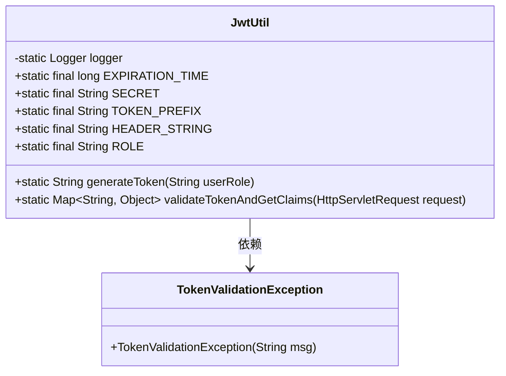
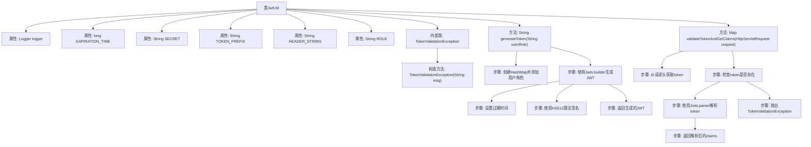

# 基础信息

|      |      |
|------|------|
| 编码语言 | .java |
| 代码路径 | boat-house-backend/src/account-service/api/src/main/java/com/idcf/boathouse/account/config/JwtUtil.java |
| 包名 | com.idcf.boathouse.account.config |
| 依赖项 | ['io.jsonwebtoken.Jwts', 'io.jsonwebtoken.SignatureAlgorithm', 'org.slf4j.Logger', 'org.slf4j.LoggerFactory', 'javax.servlet.http.HttpServletRequest', 'java.util.Date', 'java.util.HashMap', 'java.util.Map'] |
| 概述说明 | JwtUtil类负责生成和验证JWT令牌，管理角色、有效期和密钥配置。 |

# 说明

JwtUtil类是一个用于生成和验证JWT（JSON Web Token）的工具类。它支持配置角色信息、令牌的有效期以及密钥等关键参数。通过该工具类，开发者可以方便地生成包含特定角色和有效期的JWT令牌，并能够验证这些令牌的合法性，确保令牌在有效期内且未被篡改。JwtUtil类的设计旨在简化JWT的生成和验证流程，提升系统安全性和开发效率。

# 类列表 Class Summary

| 名称   | 类型  | 说明 |
|-------|------|-------------|
| JwtUtil | class | JwtUtil类用于生成和验证JWT令牌，包含角色、有效期和密钥等配置。 |

## 类 JwtUtil

|      |      |
|------|------|
| 访问范围 | public |
| 类型 | class |
| 名称 | JwtUtil |
| 说明 | JwtUtil类用于生成和验证JWT令牌，包含角色、有效期和密钥等配置。 |

### UML类图

### 描述
`JwtUtil` 类是一个用于生成和验证 JWT（JSON Web Token）的工具类。它包含一些常量，如 `EXPIRATION_TIME`、`SECRET`、`TOKEN_PREFIX` 等，用于配置 JWT 的生成和验证。`generateToken` 方法用于生成包含用户角色的 JWT，而 `validateTokenAndGetClaims` 方法用于验证请求中的 JWT 并返回其有效载荷。`TokenValidationException` 是一个自定义异常类，用于在 JWT 验证失败时抛出异常。

### 内部方法调用关系图

这段代码定义了一个`JwtUtil`类，用于生成和验证JWT（JSON Web Token）。`generateToken`方法通过用户角色生成JWT，并设置过期时间和签名算法。`validateTokenAndGetClaims`方法从HTTP请求头中获取JWT，验证其有效性并解析其中的claims。如果token缺失或无效，会抛出`TokenValidationException`异常。代码通过`Jwts`库实现JWT的生成和解析，确保安全性和有效性。

### 字段列表 Field List

| 名称  | 类型  | 说明 |
|-------|-------|------|
| logger = LoggerFactory.getLogger(JwtUtil.class) | Logger | JwtUtil类中定义了一个私有的静态日志记录器。 |
| EXPIRATION_TIME = 3600_000 | long | 定义了一个静态常量，表示过期时间为3600秒。 |
| ROLE = "ROLE" | String | 定义了一个静态不可变的字符串常量ROLE。 |
| SECRET = "ThisIsASecret" | String | 定义了一个不可变的字符串常量SECRET，值为"ThisIsASecret"。 |
| HEADER_STRING = "Authorization" | String | 定义静态常量HEADER_STRING，值为"Authorization"。 |
| TOKEN_PREFIX = "Bearer" | String | 定义常量TOKEN_PREFIX，值为"Bearer"。 |

### 方法列表 Method List

| 名称  | 类型  | 说明 |
|-------|-------|------|
| validateTokenAndGetClaims | Map<String, Object> | 验证HTTP请求中的令牌并返回声明信息。 |
| generateToken | String | 生成基于用户角色的JWT令牌，包含过期时间和签名。 |

