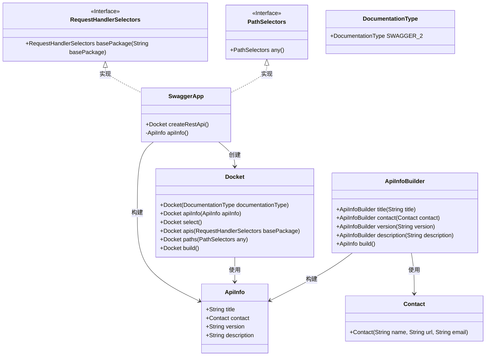
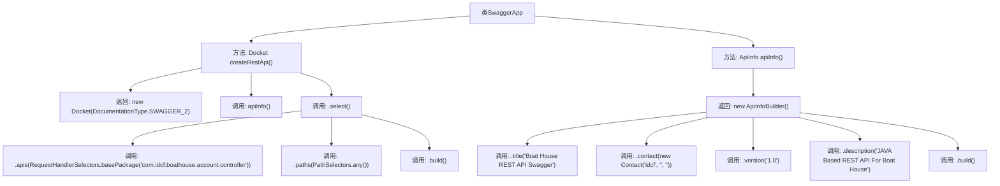

# 基础信息

|      |      |
|------|------|
| 编码语言 | .java |
| 代码路径 | boat-house-backend/src/account-service/api/src/main/java/com/idcf/boathouse/account/config/SwaggerApp.java |
| 包名 | com.idcf.boathouse.account.config |
| 依赖项 | ['springfox.documentation.service.Contact', 'org.springframework.context.annotation.Bean', 'org.springframework.context.annotation.Configuration', 'springfox.documentation.builders.ApiInfoBuilder', 'springfox.documentation.builders.PathSelectors', 'springfox.documentation.builders.RequestHandlerSelectors', 'springfox.documentation.service.ApiInfo', 'springfox.documentation.spi.DocumentationType', 'springfox.documentation.spring.web.plugins.Docket', 'springfox.documentation.swagger2.annotations.EnableSwagger2'] |
| 概述说明 | Swagger配置类用于定义API文档信息及扫描路径。 |

# 说明

Swagger配置类用于定义API文档的基本信息和扫描路径。该配置类通常包含API文档的标题、描述、版本号等元数据，以及指定需要扫描的API接口路径。通过配置类，可以确保生成的API文档准确反映当前系统的接口情况，便于开发者和用户查阅和使用。

# 类列表 Class Summary

| 名称   | 类型  | 说明 |
|-------|------|-------------|
| SwaggerApp | class | Swagger配置类，定义API文档信息及扫描路径。 |

## 类 SwaggerApp

|      |      |
|------|------|
| 访问范围 | @Configuration;@EnableSwagger2;public |
| 类型 | class |
| 名称 | SwaggerApp |
| 说明 | Swagger配置类，定义API文档信息及扫描路径。 |

### UML类图

这段代码定义了一个Spring Boot应用中的Swagger配置类`SwaggerApp`，用于生成API文档。`SwaggerApp`类中通过`createRestApi`方法创建并配置了一个`Docket`对象，该对象用于定义Swagger文档的基本信息。`apiInfo`方法则负责构建API文档的详细信息，包括标题、联系人、版本号和描述。类图展示了`SwaggerApp`与`Docket`、`ApiInfo`、`ApiInfoBuilder`、`Contact`等类之间的关系，以及`RequestHandlerSelectors`和`PathSelectors`接口的实现关系。

### 内部方法调用关系图

这段代码定义了一个Spring Boot应用中的Swagger配置类`SwaggerApp`，用于生成REST API的Swagger文档。`createRestApi()`方法创建并配置了一个`Docket`对象，指定了API的基本信息和扫描的包路径。`apiInfo()`方法构建了API文档的详细信息，包括标题、创建人、版本号和描述。通过这两个方法，Swagger能够自动生成API文档，方便开发者查看和测试API接口。

### 字段列表 Field List

| 名称  | 类型  | 说明 |
|-------|-------|------|

### 方法列表 Method List

| 名称  | 类型  | 说明 |
|-------|-------|------|
| apiInfo | ApiInfo | Boat House REST API Swagger，版本1.0，基于JAVA，创建人idcf。 |
| createRestApi | Docket | 创建Swagger API文档，指定包路径为com.idcf.boathouse.account.controller。 |

