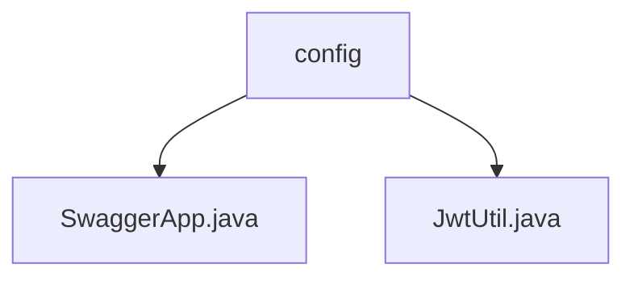

# 基础信息

|      |      |
|------|------|
| 编码语言 | .java |
| 代码路径 | boat-house-backend/src/account-service/api/src/main/java/com/idcf/boathouse/account/config |
| 包名 | boat-house-backend.src.account-service.api.src.main.java.com.idcf.boathouse.account.config |
| 概述说明 | Swagger配置类定义API文档信息，JwtUtil类生成验证JWT令牌。 |

# 说明

Swagger配置类用于定义API文档的基本信息和扫描路径，包括标题、描述、版本号等元数据，确保生成的API文档准确反映系统接口情况。JwtUtil类是一个生成和验证JWT的工具类，支持配置角色信息、有效期和密钥，简化JWT的生成和验证流程，提升系统安全性和开发效率。

### 包内部结构视图

该流程图展示了`boat-house-backend`项目中`account-service`模块下的`config`目录及其包含的文件。`config`目录下有两个文件：`SwaggerApp.java`和`JwtUtil.java`，分别用于配置Swagger和JWT工具类。这些文件在项目中用于处理API文档和身份验证相关的配置。

# 文件列表 File List

| 名称   | 类型  | 说明 |
|-------|------|-------------|
| [JwtUtil.java](JwtUtil.md) | file | JwtUtil类负责生成和验证JWT令牌，管理角色、有效期和密钥配置。 |
| [SwaggerApp.java](SwaggerApp.md) | file | Swagger配置类用于定义API文档信息及扫描路径。 |

