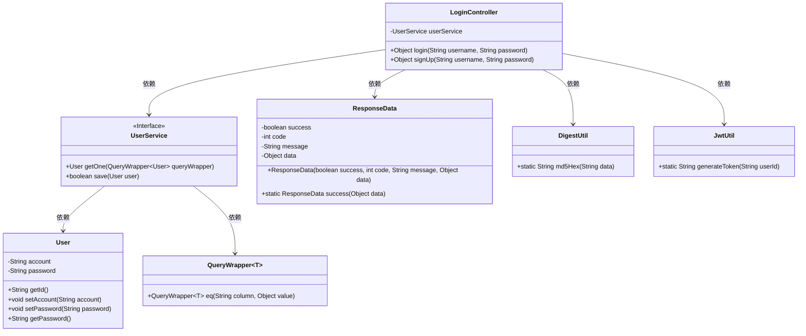
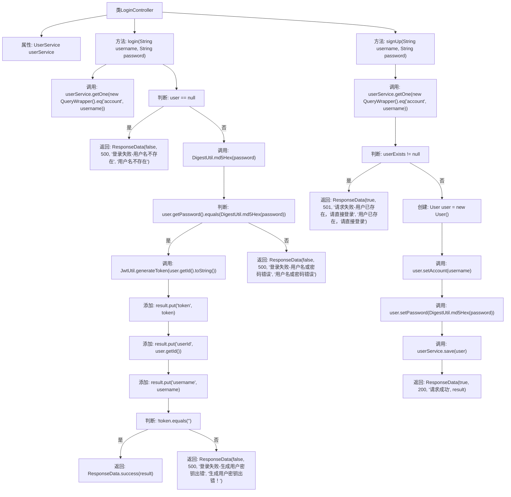

# 基础信息

|      |      |
|------|------|
| 编码语言 | .java |
| 代码路径 | boat-house-backend/src/account-service/api/src/main/java/com/idcf/boathouse/account/controller/LoginController.java |
| 包名 | com.idcf.boathouse.account.controller |
| 依赖项 | ['cn.hutool.crypto.digest.DigestUtil', 'com.baomidou.mybatisplus.core.conditions.query.QueryWrapper', 'com.idcf.boathouse.account.config.JwtUtil', 'com.idcf.boathouse.account.core.ResponseData', 'com.idcf.boathouse.account.entity.User', 'com.idcf.boathouse.account.service.UserService', 'io.swagger.annotations.Api', 'io.swagger.annotations.ApiOperation', 'io.swagger.annotations.ApiParam', 'org.springframework.beans.factory.annotation.Autowired', 'org.springframework.web.bind.annotation', 'java.util.HashMap', 'java.util.Map'] |
| 概述说明 | 登录注册接口类实现用户登录注册，验证密码并生成令牌。 |

# 说明

登录注册接口类是一个功能模块，主要用于实现用户的登录和注册操作。该接口类包含两个核心功能：登录和注册。在登录功能中，系统会验证用户输入的用户名和密码是否正确，验证通过后会生成一个令牌，用于后续的身份验证和会话管理。注册功能则允许新用户创建账户，系统会对输入的用户名和密码进行校验，确保符合要求后完成注册。该接口类旨在提供安全、可靠的用户认证机制，确保用户身份的有效性和数据的安全性。

# 类列表 Class Summary

| 名称   | 类型  | 说明 |
|-------|------|-------------|
| LoginController | class | 登录注册接口类，包含登录和注册功能，验证用户名密码并生成令牌。 |

## 类 LoginController

|      |      |
|------|------|
| 访问范围 | @RestController;@Api(tags = "登录注册接口");public |
| 类型 | class |
| 名称 | LoginController |
| 说明 | 登录注册接口类，包含登录和注册功能，验证用户名密码并生成令牌。 |

### UML类图

类图描述：
`LoginController` 是一个处理登录和注册请求的控制器，依赖于 `UserService` 来获取和保存用户信息。`UserService` 是一个接口，提供了获取单个用户和保存用户的方法。`User` 类表示用户实体，包含账户和密码等属性。`ResponseData` 用于封装响应数据，包含成功状态、状态码、消息和数据。`QueryWrapper` 是一个泛型类，用于构建查询条件。`DigestUtil` 和 `JwtUtil` 分别提供MD5加密和JWT令牌生成的功能。

### 内部方法调用关系图

这段代码定义了一个`LoginController`类，包含登录和注册两个主要方法。登录方法`login`通过用户名和密码验证用户身份，生成JWT令牌并返回登录结果。注册方法`signUp`检查用户名是否已存在，若不存在则创建新用户并保存。代码通过`UserService`与数据库交互，使用`DigestUtil`进行密码加密，`JwtUtil`生成令牌，最终返回`ResponseData`对象表示操作结果。

### 字段列表 Field List

| 名称  | 类型  | 说明 |
|-------|-------|------|
| userService | UserService | 自动注入用户服务实例。 |

### 方法列表 Method List

| 名称  | 类型  | 说明 |
|-------|-------|------|
| login | Object | 登录接口验证用户名和密码，生成token并返回用户信息。 |
| signUp | Object | 用户注册接口，检查用户名是否存在，若存在返回错误，否则保存用户信息并返回成功。 |

