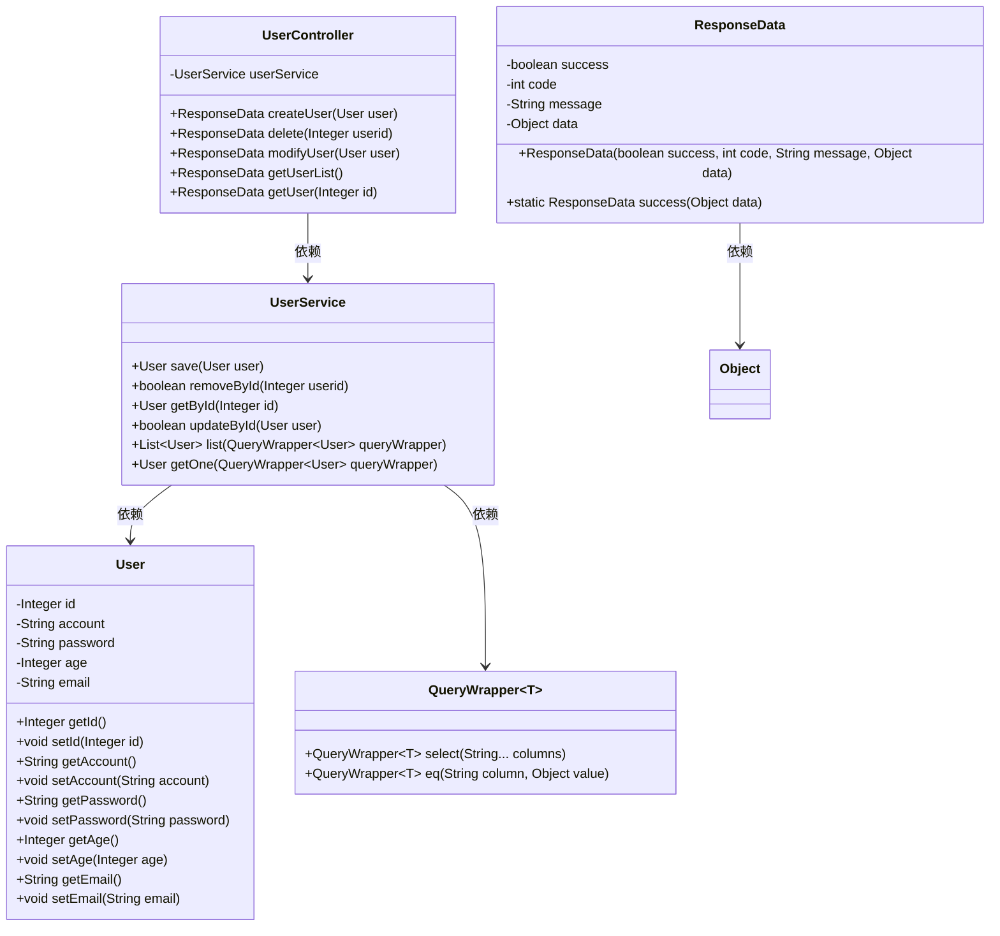
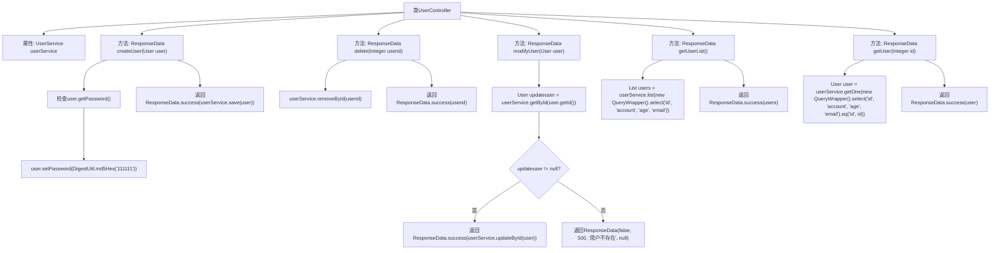

# 基础信息

|      |      |
|------|------|
| 编码语言 | .java |
| 代码路径 | boat-house-backend/src/account-service/api/src/main/java/com/idcf/boathouse/account/controller/UserController.java |
| 包名 | com.idcf.boathouse.account.controller |
| 依赖项 | ['cn.hutool.crypto.digest.DigestUtil', 'com.baomidou.mybatisplus.core.conditions.query.QueryWrapper', 'com.idcf.boathouse.account.core.ResponseData', 'com.idcf.boathouse.account.entity.User', 'com.idcf.boathouse.account.service.UserService', 'io.swagger.annotations.Api', 'io.swagger.annotations.ApiOperation', 'io.swagger.annotations.ApiParam', 'org.springframework.beans.factory.annotation.Autowired', 'org.springframework.web.bind.annotation', 'java.util.List'] |
| 概述说明 | 用户管理接口实现增删改查功能，支持创建、删除、修改、查询列表和详情。 |

# 说明

用户管理接口实现了完整的增删改查功能，涵盖用户创建、删除、信息修改、查询用户列表以及获取用户详细信息。通过这些功能，系统能够高效地管理用户数据，确保数据的完整性和可操作性。

# 类列表 Class Summary

| 名称   | 类型  | 说明 |
|-------|------|-------------|
| UserController | class | 用户管理接口实现增删改查功能，包括创建、删除、修改、查询列表和详情。 |

## 类 UserController

|      |      |
|------|------|
| 访问范围 | @RestController;@Api(tags = "用户管理接口");@RequestMapping("/user");public |
| 类型 | class |
| 名称 | UserController |
| 说明 | 用户管理接口实现增删改查功能，包括创建、删除、修改、查询列表和详情。 |

### UML类图

### 描述
`UserController` 是一个用户管理的控制器类，负责处理与用户相关的HTTP请求。它依赖于 `UserService` 来执行具体的业务逻辑，如用户的新增、删除、修改和查询。`UserService` 类提供了对用户数据的操作，包括保存、删除、更新和查询用户信息。`User` 类表示用户实体，包含用户的基本信息。`ResponseData` 类用于封装返回给客户端的数据，包含操作是否成功、状态码、消息和具体数据。`QueryWrapper` 是一个泛型类，用于构建查询条件。

### 内部方法调用关系图

这段代码定义了一个`UserController`类，负责处理用户相关的HTTP请求。它包含五个主要方法：`createUser`用于创建用户，`delete`用于删除用户，`modifyUser`用于更新用户信息，`getUserList`用于获取用户列表，`getUser`用于获取单个用户详情。每个方法都通过`UserService`进行数据库操作，并返回`ResponseData`对象作为响应。流程图展示了每个方法的执行流程，包括条件判断和数据库操作。

### 字段列表 Field List

| 名称  | 类型  | 说明 |
|-------|-------|------|
| userService | UserService | 自动注入UserService实例。 |

### 方法列表 Method List

| 名称  | 类型  | 说明 |
|-------|-------|------|
| delete | ResponseData | 删除用户接口，通过用户ID删除并返回成功信息。 |
| getUser | ResponseData | 通过GET请求获取指定ID的用户详情，返回用户信息。 |
| getUserList | ResponseData | GET请求处理用户列表查询，返回ID、账号、年龄和邮箱信息。 |
| modifyUser | ResponseData | PUT请求更新用户信息，成功返回更新数据，失败提示用户不存在。 |
| createUser | ResponseData | POST请求创建用户，处理密码默认值并保存用户信息。 |

