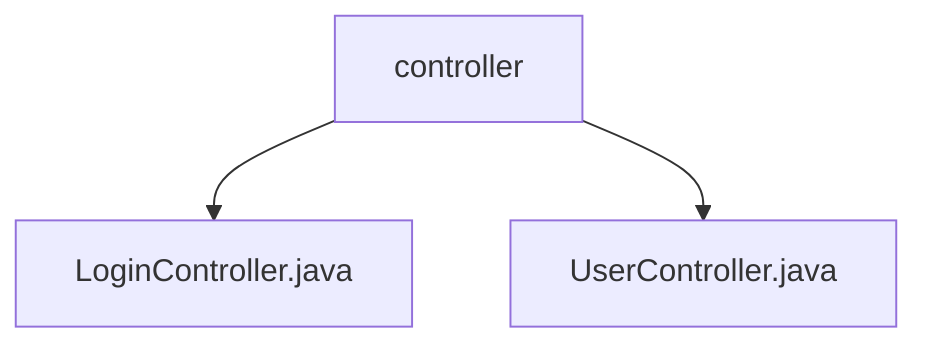

# 基础信息

|      |      |
|------|------|
| 编码语言 | .java |
| 代码路径 | boat-house-backend/src/account-service/api/src/main/java/com/idcf/boathouse/account/controller |
| 包名 | boat-house-backend.src.account-service.api.src.main.java.com.idcf.boathouse.account.controller |
| 概述说明 | 登录注册接口类实现用户登录与注册，用户管理接口提供增删改查功能。 |

# 说明

登录注册接口类是一个功能模块，主要用于实现用户的登录和注册操作。登录功能验证用户输入的用户名和密码，生成令牌用于身份验证和会话管理。注册功能允许新用户创建账户，系统校验用户名和密码后完成注册。该接口类提供安全可靠的用户认证机制，确保用户身份有效性和数据安全性。用户管理接口实现增删改查功能，涵盖用户创建、删除、信息修改、查询用户列表及获取用户详细信息，高效管理用户数据，确保数据完整性和可操作性。

### 包内部结构视图

该流程图展示了`boat-house-backend`项目中`account-service`模块下的`controller`文件夹结构。`controller`文件夹包含两个Java文件：`LoginController.java`和`UserController.java`。这两个文件分别处理登录和用户相关的逻辑，属于同一层级，且都位于`controller`文件夹下。

# 文件列表 File List

| 名称   | 类型  | 说明 |
|-------|------|-------------|
| [UserController.java](UserController.md) | file | 用户管理接口实现增删改查功能，支持创建、删除、修改、查询列表和详情。 |
| [LoginController.java](LoginController.md) | file | 登录注册接口类实现用户登录注册，验证密码并生成令牌。 |

