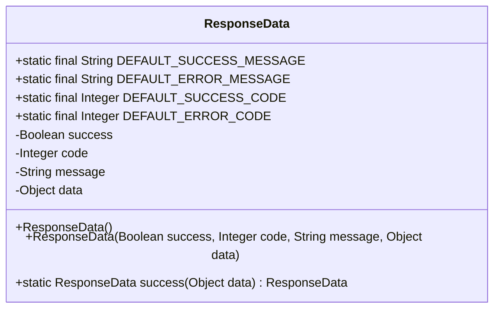
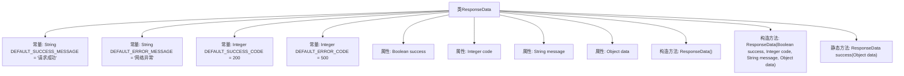

# 基础信息

|      |      |
|------|------|
| 编码语言 | .java |
| 代码路径 | boat-house-backend/src/account-service/api/src/main/java/com/idcf/boathouse/account/core/ResponseData.java |
| 包名 | com.idcf.boathouse.account.core |
| 依赖项 | ['lombok.Data'] |
| 概述说明 | ResponseData类定义响应结构，含成功标志、状态码、消息和数据，提供默认信息和构造方法。 |

# 说明

ResponseData类用于定义响应数据结构，包含四个主要属性：成功标志、状态码、消息和数据。该类提供了默认的成功和错误信息，方便直接使用。此外，ResponseData类还提供了构造方法，便于在实例化时直接设置这些属性。通过这些功能，ResponseData类能够有效地封装和传递响应信息，简化了响应数据的处理流程。

# 类列表 Class Summary

| 名称   | 类型  | 说明 |
|-------|------|-------------|
| ResponseData | class | ResponseData类定义响应数据结构，包含成功标志、状态码、消息和数据。提供默认成功和错误信息及构造方法。 |

## 类 ResponseData

|      |      |
|------|------|
| 访问范围 | @Data;public |
| 类型 | class |
| 名称 | ResponseData |
| 说明 | ResponseData类定义响应数据结构，包含成功标志、状态码、消息和数据。提供默认成功和错误信息及构造方法。 |

### UML类图

**描述**：`ResponseData` 类用于封装响应数据，包含成功状态、状态码、消息和实际数据。它提供了默认的成功和错误消息及状态码，并包含一个静态方法 `success` 用于快速生成成功的响应对象。该类通过构造函数和静态方法简化了响应对象的创建过程，适用于需要统一响应格式的场景。

### 内部方法调用关系图

**描述：**  
`ResponseData`类用于封装响应数据，包含成功与失败的默认消息和状态码。类中定义了两个构造方法，分别用于无参初始化和带参初始化。此外，提供了一个静态方法`success`，用于快速生成表示成功的响应对象。该类通过`success`、`code`、`message`和`data`属性来存储响应状态和数据。

### 字段列表 Field List

| 名称  | 类型  | 说明 |
|-------|-------|------|
| DEFAULT_ERROR_CODE = 500 | Integer | 默认错误代码为500。 |
| data | Object | 私有对象数据存储变量。 |
| DEFAULT_SUCCESS_CODE = 200 | Integer | 默认成功状态码为200。 |
| DEFAULT_SUCCESS_MESSAGE = "请求成功" | String | 定义默认成功消息为“请求成功”。 |
| code | Integer | 定义了一个私有的整型变量code。 |
| DEFAULT_ERROR_MESSAGE = "网络异常" | String | 定义默认错误消息为“网络异常”。 |
| message | String | 声明了一个私有的字符串类型变量message。 |
| success | Boolean | 私有布尔类型变量success。 |

### 方法列表 Method List

| 名称  | 类型  | 说明 |
|-------|-------|------|
| success | ResponseData | 定义成功响应方法，返回包含数据和默认成功信息的ResponseData对象。 |

