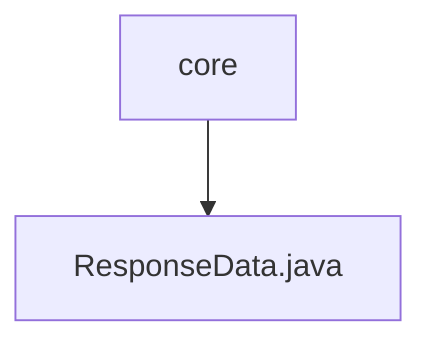

# 基础信息

|      |      |
|------|------|
| 编码语言 | .java |
| 代码路径 | boat-house-backend/src/account-service/api/src/main/java/com/idcf/boathouse/account/core |
| 包名 | boat-house-backend.src.account-service.api.src.main.java.com.idcf.boathouse.account.core |
| 概述说明 | ResponseData类定义响应结构，含成功标志、状态码、消息和数据，提供默认信息和构造方法。 |

# 说明

ResponseData类用于定义响应数据结构，包含四个主要属性：成功标志、状态码、消息和数据。该类提供了默认的成功和错误信息，方便直接使用。此外，ResponseData类还提供了构造方法，便于在实例化时直接设置这些属性。通过这些功能，ResponseData类能够有效地封装和传递响应信息，简化了响应数据的处理流程。

### 包内部结构视图

该流程图展示了路径的层级关系，核心文件夹 `core` 包含一个文件 `ResponseData.java`。结构简洁明了，清晰地表示了文件与文件夹之间的从属关系。

# 文件列表 File List

| 名称   | 类型  | 说明 |
|-------|------|-------------|
| [ResponseData.java](ResponseData.md) | file | ResponseData类定义响应结构，含成功标志、状态码、消息和数据，提供默认信息和构造方法。 |

