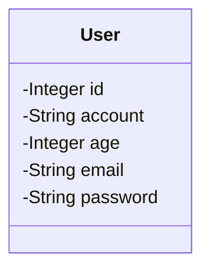
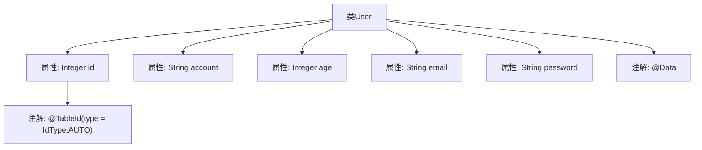

# 基础信息

|      |      |
|------|------|
| 编码语言 | .java |
| 代码路径 | boat-house-backend/src/account-service/api/src/main/java/com/idcf/boathouse/account/entity/User.java |
| 包名 | com.idcf.boathouse.account.entity |
| 依赖项 | ['com.baomidou.mybatisplus.annotation.IdType', 'com.baomidou.mybatisplus.annotation.TableId', 'lombok.Data'] |
| 概述说明 | User类包含自增主键id及account、age、email、password属性。 |

# 说明

User类包含五个主要属性：id、account、age、email和password。其中，id属性是自增主键，用于唯一标识每个用户实例。account属性用于存储用户的账户信息，age属性记录用户的年龄，email属性保存用户的电子邮件地址，password属性则用于存储用户的密码信息。这些属性共同构成了User类的基本数据结构，确保用户信息的完整性和唯一性。

# 类列表 Class Summary

| 名称   | 类型  | 说明 |
|-------|------|-------------|
| User | class | User类包含id、account、age、email和password属性，id为自增主键。 |

## 类 User

|      |      |
|------|------|
| 访问范围 | @Data;public |
| 类型 | class |
| 名称 | User |
| 说明 | User类包含id、account、age、email和password属性，id为自增主键。 |

### UML类图

这段代码定义了一个名为 `User` 的类，该类包含了用户的五个属性：`id`、`account`、`age`、`email` 和 `password`。其中，`id` 属性使用了 `@TableId(type = IdType.AUTO)` 注解，表明它是一个自增的主键。这个类通常用于表示数据库中的用户表，每个属性对应表中的一列。通过 `@Data` 注解，Lombok 库会自动生成 `getter`、`setter`、`toString` 等方法，简化了代码的编写。

### 内部方法调用关系图

这段代码定义了一个名为`User`的类，使用了`@Data`注解来自动生成getter、setter、toString等方法。类中包含五个属性：`id`、`account`、`age`、`email`和`password`。其中，`id`属性使用了`@TableId(type = IdType.AUTO)`注解，表示该字段是数据库表的主键，并且自动生成。

### 字段列表 Field List

| 名称  | 类型  | 说明 |
|-------|-------|------|
| age | Integer | 定义了一个私有整型变量age。 |
| id | Integer | 使用自动生成的主键ID作为实体类的唯一标识。 |
| email | String | 定义了一个私有的字符串类型变量email。 |
| account | String | 声明一个私有的字符串类型变量account。 |
| password | String | 声明一个私有的字符串类型变量password。 |

### 方法列表 Method List

| 名称  | 类型  | 说明 |
|-------|-------|------|

