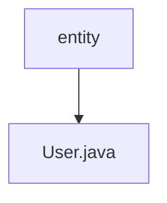

# 基础信息

|      |      |
|------|------|
| 编码语言 | .java |
| 代码路径 | boat-house-backend/src/account-service/api/src/main/java/com/idcf/boathouse/account/entity |
| 包名 | boat-house-backend.src.account-service.api.src.main.java.com.idcf.boathouse.account.entity |
| 概述说明 | User类包含自增主键id及account、age、email、password属性。 |

# 说明

User类包含五个主要属性：id、account、age、email和password。其中，id属性是自增主键，用于唯一标识每个用户实例。account属性用于存储用户的账户信息，age属性记录用户的年龄，email属性保存用户的电子邮件地址，password属性则用于存储用户的密码信息。这些属性共同构成了User类的基本数据结构，确保用户信息的完整性和唯一性。

### 包内部结构视图

该流程图展示了 `boat-house-backend` 项目中 `account-service` 模块的路径层级关系。`entity` 是 `account` 包下的一个文件夹，而 `User.java` 是 `entity` 文件夹中的一个文件。流程图简洁明了地表示了文件夹与文件之间的从属关系。

# 文件列表 File List

| 名称   | 类型  | 说明 |
|-------|------|-------------|
| [User.java](User.md) | file | User类包含自增主键id及account、age、email、password属性。 |

