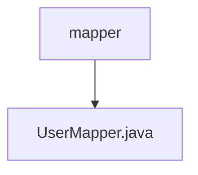

# 基础信息

|      |      |
|------|------|
| 编码语言 | .java |
| 代码路径 | boat-house-backend/src/account-service/api/src/main/java/com/idcf/boathouse/account/mapper |
| 包名 | boat-house-backend.src.account-service.api.src.main.java.com.idcf.boathouse.account.mapper |
| 概述说明 | 信息为空，无法生成概要描述。 |

# 说明

给定的内容为空，未提供任何具体信息或细节。因此，无法生成总结描述。请提供相关的内容或详细信息，以便进行准确的总结和描述。

### 包内部结构视图

该流程图展示了`boat-house-backend`项目中`account-service`模块下的`mapper`目录及其包含的`UserMapper.java`文件的层级关系。`mapper`目录是根节点，`UserMapper.java`是其子节点，表示文件位于该目录下。这种结构清晰地反映了代码的组织方式，便于开发者快速定位和理解相关文件的位置。

# 文件列表 File List

| 名称   | 类型  | 说明 |
|-------|------|-------------|
| [UserMapper.java](UserMapper.md) | file | 信息为空，无法生成概要描述。 |

