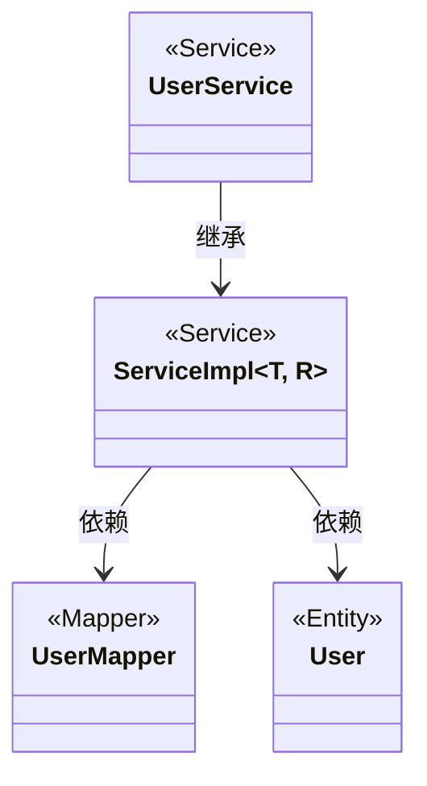
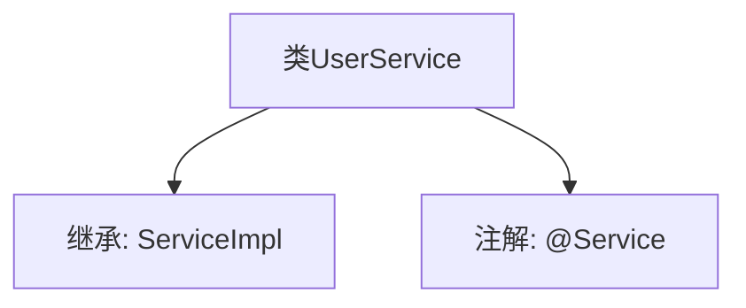

# 基础信息

|      |      |
|------|------|
| 编码语言 | .java |
| 代码路径 | boat-house-backend/src/account-service/api/src/main/java/com/idcf/boathouse/account/service/UserService.java |
| 包名 | com.idcf.boathouse.account.service |
| 依赖项 | ['com.baomidou.mybatisplus.extension.service.impl.ServiceImpl', 'com.idcf.boathouse.account.entity.User', 'com.idcf.boathouse.account.mapper.UserMapper', 'org.springframework.stereotype.Service'] |
| 概述说明 | UserService继承ServiceImpl，通过UserMapper管理User实体。 |

# 说明

UserService类继承自ServiceImpl，利用UserMapper来管理User实体。该类通过继承ServiceImpl获得了基本的服务实现功能，同时依赖UserMapper进行与User实体相关的数据操作。这种设计模式使得UserService能够专注于业务逻辑，而将数据访问细节委托给UserMapper处理，从而实现了职责分离和代码复用。

# 类列表 Class Summary

| 名称   | 类型  | 说明 |
|-------|------|-------------|
| UserService | class | UserService类继承ServiceImpl，使用UserMapper管理User实体。 |

## 类 UserService

|      |      |
|------|------|
| 访问范围 | @Service;public |
| 类型 | class |
| 名称 | UserService |
| 说明 | UserService类继承ServiceImpl，使用UserMapper管理User实体。 |

### UML类图

**描述：**
`UserService` 类继承自 `ServiceImpl` 泛型类，`ServiceImpl` 类依赖于 `UserMapper` 和 `User` 类。`UserMapper` 是一个数据访问层接口，`User` 是一个实体类。`UserService` 通过继承 `ServiceImpl` 获得了对 `UserMapper` 和 `User` 的操作能力，实现了业务逻辑与数据访问的分离。

### 内部方法调用关系图

这段代码定义了一个名为 `UserService` 的类，该类继承了 `ServiceImpl<UserMapper, User>`，并且使用了 `@Service` 注解。`@Service` 注解通常用于标记一个类作为服务层的组件，使其能够被 Spring 框架自动扫描并管理。继承 `ServiceImpl<UserMapper, User>` 意味着 `UserService` 类将拥有 `ServiceImpl` 的所有功能，并且专门处理 `User` 类型的数据，使用 `UserMapper` 作为数据访问对象。

### 字段列表 Field List

| 名称  | 类型  | 说明 |
|-------|-------|------|

### 方法列表 Method List

| 名称  | 类型  | 说明 |
|-------|-------|------|

