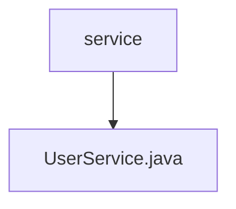

# 基础信息

|      |      |
|------|------|
| 编码语言 | .java |
| 代码路径 | boat-house-backend/src/account-service/api/src/main/java/com/idcf/boathouse/account/service |
| 包名 | boat-house-backend.src.account-service.api.src.main.java.com.idcf.boathouse.account.service |
| 概述说明 | UserService继承ServiceImpl，通过UserMapper管理User实体。 |

# 说明

UserService类继承自ServiceImpl，利用UserMapper来管理User实体。该类通过继承ServiceImpl获得了基本的服务实现功能，同时依赖UserMapper进行与User实体相关的数据操作。这种设计模式使得UserService能够专注于业务逻辑，而将数据访问细节委托给UserMapper处理，从而实现了职责分离和代码复用。

### 包内部结构视图

此流程图展示了路径的层级关系，根节点为 `service`，其下包含一个子节点 `UserService.java`。该图清晰地表示了 `UserService.java` 文件位于 `service` 目录下的结构关系，简洁明了地展示了文件与目录的从属关系。

# 文件列表 File List

| 名称   | 类型  | 说明 |
|-------|------|-------------|
| [UserService.java](UserService.md) | file | UserService继承ServiceImpl，通过UserMapper管理User实体。 |

