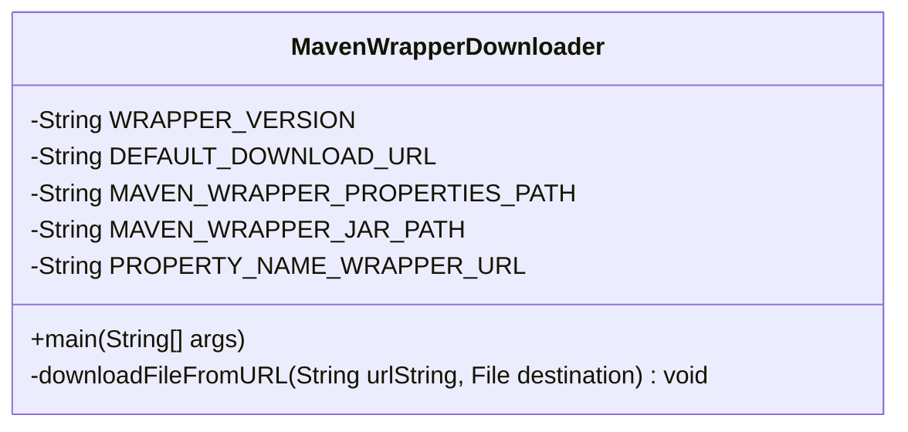

# 基础信息

|      |      |
|------|------|
| 编码语言 | .java |
| 代码路径 | boat-house-backend/src/product-service/api/.mvn/wrapper/MavenWrapperDownloader.java |
| 包名 | None |
| 依赖项 | ['java.net', 'java.io', 'java.nio.channels', 'java.util.Properties'] |
| 概述说明 | MavenWrapperDownloader类下载指定版本maven-wrapper.jar，支持自定义URL。 |

# 说明

MavenWrapperDownloader类的主要功能是下载指定版本的maven-wrapper.jar文件。该类支持用户自定义下载URL，提供了灵活性以适应不同的下载源。通过该类，用户可以便捷地获取所需的maven-wrapper.jar版本，确保项目构建环境的统一性和一致性。

# 类列表 Class Summary

| 名称   | 类型  | 说明 |
|-------|------|-------------|
| MavenWrapperDownloader | class | MavenWrapperDownloader类用于下载指定版本的maven-wrapper.jar，支持自定义下载URL。 |


## 类 MavenWrapperDownloader

|      |      |
|------|------|
| 访问范围 | public |
| 类型 | class |
| 名称 | MavenWrapperDownloader |
| 说明 | MavenWrapperDownloader类用于下载指定版本的maven-wrapper.jar，支持自定义下载URL。 |


### UML类图



```mermaid
sequenceDiagram
    participant Main as main(String[] args)
    participant MavenWrapperDownloader
    participant File
    participant Properties
    participant URL
    participant Authenticator
    participant FileOutputStream
    participant ReadableByteChannel

    Main->>MavenWrapperDownloader: 初始化
    Main->>File: 创建 baseDirectory
    Main->>File: 创建 mavenWrapperPropertyFile
    alt mavenWrapperPropertyFile 存在
        Main->>FileInputStream: 打开文件流
        Main->>Properties: 加载属性
        Main->>Properties: 获取 wrapperUrl
        Main->>FileInputStream: 关闭文件流
    end
    Main->>File: 创建 outputFile
    alt outputFile 的父目录不存在
        Main->>File: 创建父目录
    end
    Main->>MavenWrapperDownloader: downloadFileFromURL
    MavenWrapperDownloader->>Authenticator: 设置认证
    MavenWrapperDownloader->>URL: 打开连接
    MavenWrapperDownloader->>ReadableByteChannel: 创建通道
    MavenWrapperDownloader->>FileOutputStream: 创建输出流
    MavenWrapperDownloader->>FileOutputStream: 传输数据
    MavenWrapperDownloader->>FileOutputStream: 关闭流
    MavenWrapperDownloader->>ReadableByteChannel: 关闭通道
```

### 描述
`MavenWrapperDownloader` 类用于从指定URL下载Maven Wrapper的JAR文件。它首先检查是否存在自定义的下载URL配置文件，若存在则使用该URL，否则使用默认URL。下载过程中，如果目标目录不存在，则会自动创建。下载完成后，程序会退出并返回相应的状态码。该类还支持通过环境变量设置认证信息，以确保下载过程的安全性。


### 内部方法调用关系图

```mermaid
graph TD
    A["类MavenWrapperDownloader"]
    B["常量: String WRAPPER_VERSION"]
    C["常量: String DEFAULT_DOWNLOAD_URL"]
    D["常量: String MAVEN_WRAPPER_PROPERTIES_PATH"]
    E["常量: String MAVEN_WRAPPER_JAR_PATH"]
    F["常量: String PROPERTY_NAME_WRAPPER_URL"]
    G["main方法: main(String[] args)"]
    H["输出: System.out.println('- Downloader started')"]
    I["创建: File baseDirectory = new File(args[0])"]
    J["输出: System.out.println('- Using base directory: ' + baseDirectory.getAbsolutePath())"]
    K["创建: File mavenWrapperPropertyFile = new File(baseDirectory, MAVEN_WRAPPER_PROPERTIES_PATH)"]
    L["判断: if (mavenWrapperPropertyFile.exists())"]
    M["读取: FileInputStream mavenWrapperPropertyFileInputStream = new FileInputStream(mavenWrapperPropertyFile)"]
    N["加载: Properties mavenWrapperProperties = new Properties()"]
    O["读取属性: url = mavenWrapperProperties.getProperty(PROPERTY_NAME_WRAPPER_URL, url)"]
    P["异常处理: catch (IOException e)"]
    Q["关闭流: mavenWrapperPropertyFileInputStream.close()"]
    R["输出: System.out.println('- Downloading from: ' + url)"]
    S["创建: File outputFile = new File(baseDirectory.getAbsolutePath(), MAVEN_WRAPPER_JAR_PATH)"]
    T["判断: if (!outputFile.getParentFile().exists())"]
    U["创建目录: outputFile.getParentFile().mkdirs()"]
    V["输出: System.out.println('- ERROR creating output directory ' + outputFile.getParentFile().getAbsolutePath())"]
    W["输出: System.out.println('- Downloading to: ' + outputFile.getAbsolutePath())"]
    X["调用: downloadFileFromURL(url, outputFile)"]
    Y["输出: System.out.println('Done')"]
    Z["退出: System.exit(0)"]
    AA["异常处理: catch (Throwable e)"]
    AB["输出: System.out.println('- Error downloading')"]
    AC["打印堆栈: e.printStackTrace()"]
    AD["退出: System.exit(1)"]
    AE["方法: downloadFileFromURL(String urlString, File destination)"]
    AF["判断: if (System.getenv('MVNW_USERNAME') != null && System.getenv('MVNW_PASSWORD') != null)"]
    AG["获取: String username = System.getenv('MVNW_USERNAME')"]
    AH["获取: char[] password = System.getenv('MVNW_PASSWORD').toCharArray()"]
    AI["设置: Authenticator.setDefault(new Authenticator() { ... })"]
    AJ["创建: URL website = new URL(urlString)"]
    AK["创建: ReadableByteChannel rbc = Channels.newChannel(website.openStream())"]
    AL["创建: FileOutputStream fos = new FileOutputStream(destination)"]
    AM["传输: fos.getChannel().transferFrom(rbc, 0, Long.MAX_VALUE)"]
    AN["关闭: fos.close()"]
    AO["关闭: rbc.close()"]

    A --> B
    A --> C
    A --> D
    A --> E
    A --> F
    A -.-> G
    G --> H
    G --> I
    G --> J
    G --> K
    G --> L
    L --> M
    M --> N
    N --> O
    L --> P
    M --> Q
    G --> R
    G --> S
    G --> T
    T --> U
    T --> V
    G --> W
    G --> X
    X --> Y
    Y --> Z
    X --> AA
    AA --> AB
    AB --> AC
    AC --> AD
    A -.-> AE
    AE --> AF
    AF --> AG
    AG --> AH
    AH --> AI
    AE --> AJ
    AJ --> AK
    AK --> AL
    AL --> AM
    AM --> AN
    AN --> AO
```



**流程图描述：**  
该流程图展示了`MavenWrapperDownloader`类的执行流程，从启动下载器、读取配置文件、确定下载URL、创建输出目录，到最终下载文件并处理可能的异常。流程中包含了文件读取、属性加载、目录创建、文件下载等关键步骤，并详细展示了异常处理机制。整个过程确保了Maven Wrapper的下载和保存的完整性和安全性。

### 字段列表 Field List

| 名称  | 类型  | 说明 |
|-------|-------|------|
| WRAPPER_VERSION = "0.5.6" | String | 私有静态常量WRAPPER_VERSION值为"0.5.6"。 |
| MAVEN_WRAPPER_PROPERTIES_PATH =
            ".mvn/wrapper/maven-wrapper.properties" | String | Maven包装器配置文件路径为.mvn/wrapper/maven-wrapper.properties。 |
| DEFAULT_DOWNLOAD_URL = "https://repo.maven.apache.org/maven2/io/takari/maven-wrapper/"
            + WRAPPER_VERSION + "/maven-wrapper-" + WRAPPER_VERSION + ".jar" | String | 默认下载URL为Maven仓库中特定版本的wrapper JAR文件。 |
| PROPERTY_NAME_WRAPPER_URL = "wrapperUrl" | String | 定义常量PROPERTY_NAME_WRAPPER_URL，值为"wrapperUrl"。 |
| MAVEN_WRAPPER_JAR_PATH =
            ".mvn/wrapper/maven-wrapper.jar" | String | Maven包装器JAR文件路径为.mvn/wrapper/maven-wrapper.jar。 |

### 方法列表 Method List

| 名称  | 类型  | 说明 |
|-------|-------|------|
| main | void | Java程序下载文件，检查Maven配置，指定下载路径并处理错误。 |
| downloadFileFromURL | void | 从URL下载文件到本地，支持环境变量认证，使用通道传输数据。 |


