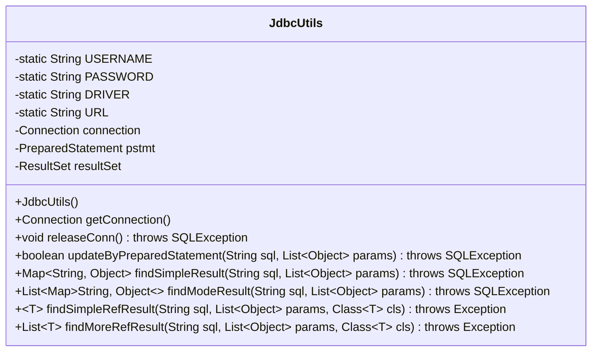

# 基础信息

|      |      |
|------|------|
| 编码语言 | .java |
| 代码路径 | boat-house-backend/src/product-service/api/src/main/java/com/idcf/boathouse/product/JdbcUtils.java |
| 包名 | com.idcf.boathouse.product |
| 依赖项 | ['com.idcf.boathouse.product.untils.SpringContextHolder', 'java.io.IOException', 'java.io.InputStream', 'java.lang.reflect.Field', 'java.sql', 'java.util'] |
| 概述说明 | JdbcUtils类提供数据库连接与增删改查操作。 |

# 说明

JdbcUtils类是一个用于数据库连接与操作的工具类，提供了对数据库进行增删改查操作的功能，并支持通过反射机制进行查询。该类简化了数据库操作的流程，帮助开发者高效地进行数据交互。

# 类列表 Class Summary

| 名称   | 类型  | 说明 |
|-------|------|-------------|
| JdbcUtils | class | JdbcUtils类用于数据库连接与操作，支持增删改查及反射查询。 |

## 类 JdbcUtils

|      |      |
|------|------|
| 访问范围 | public |
| 类型 | class |
| 名称 | JdbcUtils |
| 说明 | JdbcUtils类用于数据库连接与操作，支持增删改查及反射查询。 |

### UML类图

**描述：**
`JdbcUtils` 类是一个用于简化JDBC操作的实用工具类。它通过读取配置文件初始化数据库连接信息，并提供了获取连接、释放连接、执行增删改查操作的方法。类中包含静态成员变量存储数据库连接信息，私有成员变量用于管理数据库连接、预处理语句和结果集。通过反射机制，该类还支持将查询结果映射到自定义的Java对象中。

### 内部方法调用关系图

```mermaid
graph TD
    A["类JdbcUtils"]
    B["属性: String USERNAME"]
    C["属性: String PASSWORD"]
    D["属性: String DRIVER"]
    E["属性: String URL"]
    F["属性: Connection connection"]
    G["属性: PreparedStatement pstmt"]
    H["属性: ResultSet resultSet"]
    I["构造方法: JdbcUtils()"]
    J["方法: Connection getConnection()"]
    K["方法: void releaseConn()"]
    L["方法: boolean updateByPreparedStatement(String sql, List<Object> params)"]
    M["方法: Map<String, Object> findSimpleResult(String sql, List<Object> params)"]
    N["方法: List<Map<String, Object>> findModeResult(String sql, List<Object> params)"]
    O["方法: <T> T findSimpleRefResult(String sql, List<Object> params, Class<T> cls)"]
    P["方法: <T> List<T> findMoreRefResult(String sql, List<Object> params, Class<T> cls)"]

    A --> B
    A --> C
    A --> D
    A --> E
    A --> F
    A --> G
    A --> H
    A --> I
    A --> J
    A --> K
    A --> L
    A --> M
    A --> N
    A --> O
    A --> P
```

这段代码定义了一个名为 `JdbcUtils` 的类，用于管理与数据库的连接和操作。类中包含多个属性用于存储数据库连接信息，以及多个方法用于执行数据库操作，如获取连接、释放连接、执行增删改查等操作。代码通过加载配置文件来初始化数据库连接信息，并提供了多种查询和更新数据的方法，包括通过反射机制将查询结果映射到对象中。

### 字段列表 Field List

| 名称  | 类型  | 说明 |
|-------|-------|------|
| USERNAME | String | 定义私有静态字符串变量USERNAME。 |
| resultSet | ResultSet | 定义私有ResultSet类型变量resultSet。 |
| pstmt | PreparedStatement | 私有PreparedStatement变量pstmt声明。 |
| DRIVER | String | 定义了一个私有的静态字符串变量DRIVER。 |
| PASSWORD | String | 定义了一个私有的静态字符串变量PASSWORD。 |
| URL | String | 定义了一个私有的静态字符串变量URL。 |
| connection | Connection | 私有变量connection用于存储数据库连接。 |

### 方法列表 Method List

| 名称  | 类型  | 说明 |
|-------|-------|------|
| releaseConn | void | 释放数据库连接，关闭结果集和预处理语句。 |
| updateByPreparedStatement | boolean | 该方法通过预编译SQL语句更新数据库，返回操作是否成功。 |
| getConnection | Connection | 获取数据库连接，捕获SQL异常并打印堆栈信息。 |
| findMoreRefResult | List<T> | 通过SQL查询和参数列表，返回指定类型的对象列表。 |
| findSimpleResult | Map<String, Object> | 方法执行SQL查询，返回结果映射为键值对。 |
| findModeResult | List<Map<String, Object>> | 该方法执行SQL查询并返回结果列表，支持参数化查询，处理空值。 |
| findSimpleRefResult | T | 该方法通过SQL查询和参数列表，返回指定类的实例，映射查询结果到类字段。 |

