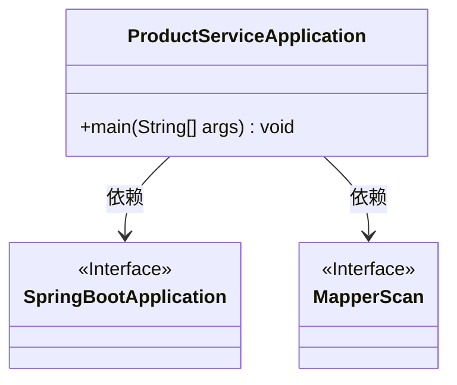
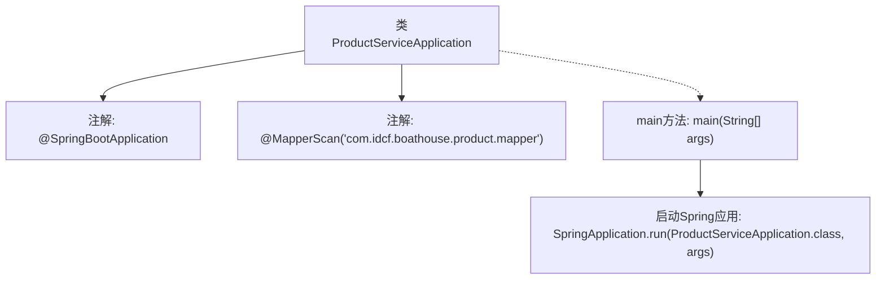

# 基础信息

|      |      |
|------|------|
| 编码语言 | .java |
| 代码路径 | boat-house-backend/src/product-service/api/src/main/java/com/idcf/boathouse/product/ProductServiceApplication.java |
| 包名 | com.idcf.boathouse.product |
| 依赖项 | ['org.mybatis.spring.annotation.MapperScan', 'org.springframework.boot.SpringApplication', 'org.springframework.boot.autoconfigure.SpringBootApplication'] |
| 概述说明 | Spring Boot启动类扫描Mapper包并启动应用。 |

# 说明

Spring Boot应用启动类的主要功能是扫描指定的Mapper包，并启动整个应用。通过配置扫描路径，确保相关的Mapper接口能够被正确识别和加载，从而支持数据库操作。启动类作为应用的入口，负责初始化Spring Boot框架，并启动内嵌的服务器，使应用能够正常运行并对外提供服务。

# 类列表 Class Summary

| 名称   | 类型  | 说明 |
|-------|------|-------------|
| ProductServiceApplication | class | Spring Boot应用启动类，扫描指定Mapper包，启动应用。 |

## 类 ProductServiceApplication

|      |      |
|------|------|
| 访问范围 | @SpringBootApplication;@MapperScan("com.idcf.boathouse.product.mapper");public |
| 类型 | class |
| 名称 | ProductServiceApplication |
| 说明 | Spring Boot应用启动类，扫描指定Mapper包，启动应用。 |

### UML类图

这段代码定义了一个名为 `ProductServiceApplication` 的类，该类使用了 `@SpringBootApplication` 和 `@MapperScan` 注解。`@SpringBootApplication` 是一个组合注解，用于简化 Spring Boot 应用的配置，而 `@MapperScan` 用于指定 MyBatis 的 Mapper 接口扫描路径。`ProductServiceApplication` 类包含一个 `main` 方法，用于启动 Spring Boot 应用。类图中展示了 `ProductServiceApplication` 对 `SpringBootApplication` 和 `MapperScan` 的依赖关系。

### 内部方法调用关系图

这段代码定义了一个名为`ProductServiceApplication`的Spring Boot应用类，使用了`@SpringBootApplication`注解来标识这是一个Spring Boot应用，并且通过`@MapperScan`注解指定了Mapper接口的扫描路径。在`main`方法中，通过`SpringApplication.run`方法启动了该Spring Boot应用。流程图展示了类的结构、注解的使用以及应用的启动过程。

### 字段列表 Field List

| 名称  | 类型  | 说明 |
|-------|-------|------|

### 方法列表 Method List

| 名称  | 类型  | 说明 |
|-------|-------|------|
| main | void | 启动Spring Boot应用ProductServiceApplication的主方法。 |

