# 基础信息

|      |      |
|------|------|
| 编码语言 | .java |
| 代码路径 | boat-house-backend/src/product-service/api/src/main/java/com/idcf/boathouse/product |
| 包名 | boat-house-backend.src.product-service.api.src.main.java.com.idcf.boathouse.product |
| 概述说明 | JdbcUtils类简化数据库操作，各类控制器管理加盟、菜品、订单等功能，BaseDao封装SQL执行，Spring Boot启动类初始化应用，Swagger配置生成API文档。 |

# 说明

JdbcUtils类简化数据库操作，支持增删改查和反射查询。多个控制器处理加盟、船坞故事、菜品、购物车、订单等功能，提供增删改查和流程管理。BaseController定义状态码和封装操作结果。多个实体类如OrderItemsVo、FoodCategoryPost、IntroPage等，描述订单项、食品类别、页面信息等。工具类如DateUtils、ActionResult、全局异常处理器、SpringContextHolder等，提供日期格式化、操作结果封装、异常处理和上下文管理。BaseDao封装SQL执行，简化数据库交互。Spring Boot启动类扫描Mapper包并启动应用。多个服务类如订单服务、IntroPageService、FoodService等，管理订单、页面、食品和购物车数据。Swagger配置类启用Swagger2，自动生成API文档。

### 包内部结构视图

```mermaid
graph TD
    product --> JdbcUtils.java
    product --> controller
    product --> enums
    product --> vo
    product --> models
    product --> untils
    product --> dao
    product --> dbentity
    product --> ProductServiceApplication.java
    product --> services
    product --> swagger
    product --> mapper
    controller --> JoinUsController.java
    controller --> IntroPageController.java
    controller --> FoodController.java
    controller --> BaseController.java
    controller --> ShopCartController.java
    controller --> BoatHouseController.java
    controller --> OrderController.java
    enums --> ResponseEnum.java
    enums --> OrderStatusEnum.java
    vo --> OrderItemsVo.java
    vo --> OrderItemsCreateVo.java
    vo --> OrderCreateVo.java
    vo --> OrderVo.java
    models --> FoodCategoryPost.java
    models --> IntroPage.java
    models --> OrderItems.java
    models --> FoodCategory.java
    models --> Orders.java
    models --> ShopCartPost.java
    models --> IntroPageFront.java
    models --> Food.java
    models --> FoodPost.java
    models --> constant
    models --> ShopCartPut.java
    models --> ShopCart.java
    models --> JoinUs.java
    models --> IntroPageValues.java
    constant --> OrderConstant.java
    untils --> DateUtils.java
    untils --> ActionResult.java
    untils --> GlobalExceptionHandler.java
    untils --> SpringContextHolder.java
    dao --> BaseDao.java
    dbentity --> IntroPageEntity.java
    services --> OrderService.java
    services --> IntroPageService.java
    services --> FoodService.java
    services --> ShopCartService.java
    services --> FoodCategoryService.java
    swagger --> SwaggerApp.java
    mapper --> OrderItemsMapper.java
    mapper --> IntroPageMapper.java
    mapper --> OrdersMapper.java
    mapper --> JoinUsMapper.java
```

该流程图展示了`product`模块的层级结构，包括控制器、枚举、视图对象、模型、工具类、数据访问对象、数据库实体、服务、Swagger配置和映射器等子模块。每个子模块下包含具体的类文件，展示了模块内部的详细组织结构。

# 文件列表 File List

| 名称   | 类型  | 说明 |
|-------|------|-------------|
| [ProductServiceApplication.java](ProductServiceApplication.md) | file | Spring Boot启动类扫描Mapper包并启动应用。 |
| [JdbcUtils.java](JdbcUtils.md) | file | JdbcUtils类提供数据库连接与增删改查操作。 |
| [mapper](mapper/_module.md) | package | 内容为空，无法生成总结描述。请提供具体信息。 |
| [swagger](swagger/_module.md) | package | Swagger配置类启用Swagger2，设置API信息并指定扫描包路径。 |
| [services](services/_module.md) | package | 订单服务类管理订单流程，IntroPageService管理船坞故事数据，FoodService管理食品信息，ShopCartService管理购物车，FoodCategoryService验证食品分类名称。 |
| [dbentity](dbentity/_module.md) | package | IntroPageEntity类包含页面ID、标题、API链接、文本、图片、删除状态及创建更新时间。 |
| [dao](dao/_module.md) | package | BaseDao类通过JdbcUtils管理数据库连接，支持查询、获取对象和更新操作。 |
| [untils](untils/_module.md) | package | DateUtils格式化日期，ActionResult封装操作结果，全局异常处理器统一处理异常，SpringContextHolder管理Spring上下文。 |
| [models](models/_module.md) | package | 各类包含ID、名称、描述等属性，用于管理和展示食品、订单、购物车等信息。 |
| [vo](vo/_module.md) | package | 订单类及其相关类用于描述和管理订单信息，包括订单项、用户、支付、状态、时间等关键属性。 |
| [enums](enums/_module.md) | package | 内容为空，无法生成总结描述。请提供具体信息。 |
| [controller](controller/_module.md) | package | 加盟接口控制器处理加盟申请和列表查询。船坞故事接口控制器管理介绍页内容。Boat House Food API控制器管理菜品数据。BaseController定义状态码和信息返回方法。ShopCartController实现购物车功能。BoatHouseController管理菜品分类。订单控制器处理订单查询、接单、拒单和创建。 |

