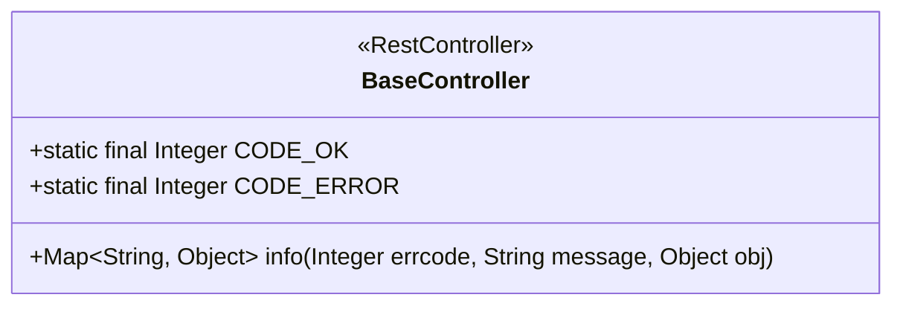
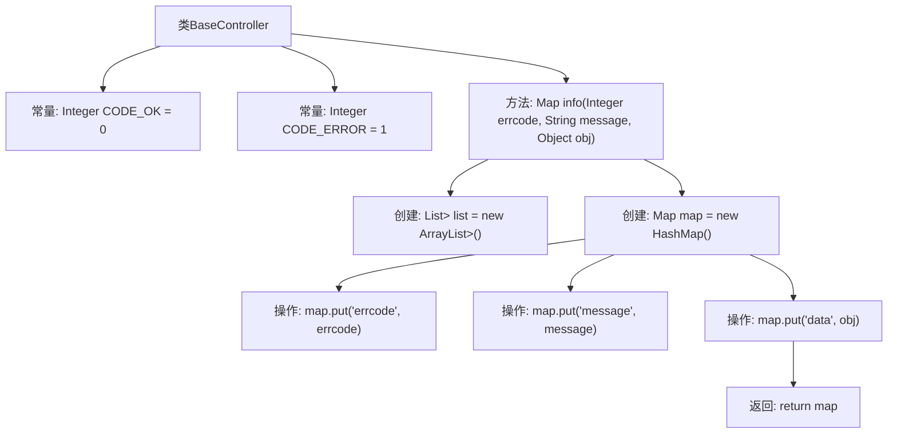

# 基础信息

|      |      |
|------|------|
| 编码语言 | .java |
| 代码路径 | boat-house-backend/src/product-service/api/src/main/java/com/idcf/boathouse/product/controller/BaseController.java |
| 包名 | com.idcf.boathouse.product.controller |
| 依赖项 | ['org.springframework.web.bind.annotation', 'java.util.ArrayList', 'java.util.HashMap', 'java.util.List', 'java.util.Map'] |
| 概述说明 | BaseController定义CODE_OK和CODE_ERROR，提供info方法返回错误码、消息和数据的Map。 |

# 说明

BaseController类定义了两个常量CODE_OK和CODE_ERROR，分别表示操作成功和操作失败的状态码。该类提供了一个名为info的方法，用于返回一个包含错误码、消息和数据的Map结构。这个方法通常用于封装和返回操作结果，便于统一处理成功和失败的响应格式。

# 类列表 Class Summary

| 名称   | 类型  | 说明 |
|-------|------|-------------|
| BaseController | class | BaseController定义了CODE_OK和CODE_ERROR，提供info方法返回包含错误码、消息和数据的Map。 |

## 类 BaseController

|      |      |
|------|------|
| 访问范围 | @RestController;public |
| 类型 | class |
| 名称 | BaseController |
| 说明 | BaseController定义了CODE_OK和CODE_ERROR，提供info方法返回包含错误码、消息和数据的Map。 |

### UML类图

**描述：**  
`BaseController` 类是一个带有 `@RestController` 注解的控制器类，用于处理HTTP请求。该类包含两个静态常量 `CODE_OK` 和 `CODE_ERROR`，分别表示正常和错误的状态码。`info` 方法接收错误码、消息和对象作为参数，并返回一个包含这些信息的 `Map`。该方法将错误码、消息和对象封装到一个 `HashMap` 中，并返回该 `Map`。

### 内部方法调用关系图

这段代码定义了一个名为 `BaseController` 的类，其中包含两个常量 `CODE_OK` 和 `CODE_ERROR`，以及一个名为 `info` 的方法。`info` 方法接收三个参数：`errcode`、`message` 和 `obj`，并返回一个包含这些信息的 `Map`。流程图展示了从类定义到方法执行，再到返回结果的完整过程。

### 字段列表 Field List

| 名称  | 类型  | 说明 |
|-------|-------|------|
| CODE_OK = 0 | Integer | 定义了公共静态常量CODE_OK，值为0。 |
| CODE_ERROR = 1 | Integer | 定义错误代码常量，值为1。 |

### 方法列表 Method List

| 名称  | 类型  | 说明 |
|-------|-------|------|
| info | Map<String, Object> | 方法info返回包含错误码、消息和数据的Map。 |

