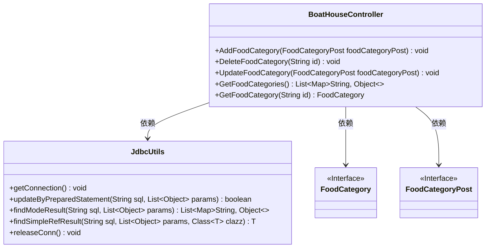
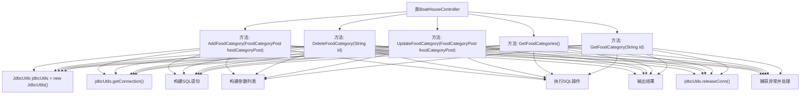

# 基础信息

|      |      |
|------|------|
| 编码语言 | .java |
| 代码路径 | boat-house-backend/src/product-service/api/src/main/java/com/idcf/boathouse/product/controller/BoatHouseController.java |
| 包名 | com.idcf.boathouse.product.controller |
| 依赖项 | ['com.idcf.boathouse.product.JdbcUtils', 'com.idcf.boathouse.product.models.FoodCategory', 'com.idcf.boathouse.product.models.FoodCategoryPost', 'io.swagger.annotations.Api', 'io.swagger.annotations.ApiOperation', 'org.springframework.web.bind.annotation', 'java.sql.SQLException', 'java.util.ArrayList', 'java.util.List', 'java.util.Map'] |
| 概述说明 | BoatHouseController提供菜品分类的增删改查API，使用JDBC操作数据库。 |

# 说明

BoatHouseController提供了菜品分类的增删改查API，这些API允许用户对菜品分类进行创建、删除、更新和查询操作。该控制器使用JDBC技术直接与数据库进行交互，确保数据操作的准确性和高效性。通过这些API，用户可以方便地管理菜品分类信息，实现数据的动态维护和查询。

# 类列表 Class Summary

| 名称   | 类型  | 说明 |
|-------|------|-------------|
| BoatHouseController | class | BoatHouseController提供菜品分类的增删改查API，使用JDBC操作数据库。 |

## 类 BoatHouseController

|      |      |
|------|------|
| 访问范围 | @RestController;@Api(tags = "Boat House Test API");@RequestMapping("/BoatHouse/*");public |
| 类型 | class |
| 名称 | BoatHouseController |
| 说明 | BoatHouseController提供菜品分类的增删改查API，使用JDBC操作数据库。 |

### UML类图

这段代码定义了一个名为 `BoatHouseController` 的控制器类，用于处理与“菜品分类”相关的HTTP请求。控制器通过 `JdbcUtils` 类与数据库进行交互，执行增删改查操作。`FoodCategory` 和 `FoodCategoryPost` 是接口，分别用于表示菜品分类的数据结构和请求体。控制器的方法通过 `JdbcUtils` 执行SQL语句，并返回相应的结果或状态。

### 内部方法调用关系图

这段代码定义了一个名为 `BoatHouseController` 的类，该类包含五个方法，分别用于添加、删除、更新和查询菜品分类。每个方法首先创建一个 `JdbcUtils` 对象并获取数据库连接，然后构建SQL语句和参数列表，执行SQL操作，输出结果，最后释放数据库连接。如果在执行过程中发生异常，代码会捕获并处理异常。这些方法通过HTTP请求映射到不同的URL路径，并使用不同的HTTP方法（POST、DELETE、PUT、GET）来实现不同的功能。

### 字段列表 Field List

| 名称  | 类型  | 说明 |
|-------|-------|------|

### 方法列表 Method List

| 名称  | 类型  | 说明 |
|-------|-------|------|
| AddFoodCategory | void | 通过POST请求添加菜品分类，使用JDBC插入数据库并处理异常。 |
| UpdateFoodCategory | void | 通过PUT请求更新菜品分类，使用SQL语句修改数据库中的名称和描述。 |
| GetFoodCategories | List<Map<String, Object>> | 通过GET请求获取所有菜品分类，返回JSON格式数据。 |
| DeleteFoodCategory | void | 通过ID删除菜品分类的API接口，使用JDBC执行SQL删除操作。 |
| GetFoodCategory | FoodCategory | 通过ID查询菜品分类信息并返回JSON格式结果。 |

