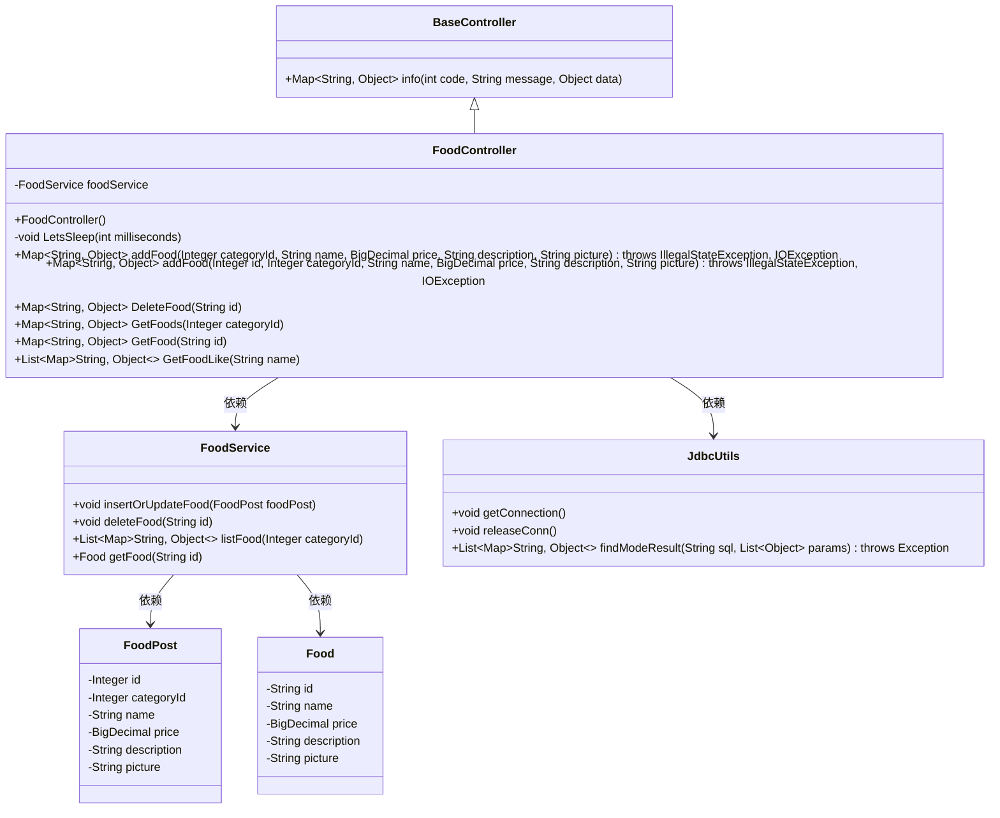
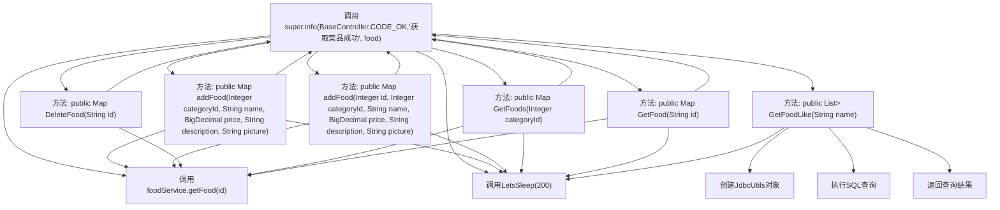

# 基础信息

|      |      |
|------|------|
| 编码语言 | .java |
| 代码路径 | boat-house-backend/src/product-service/api/src/main/java/com/idcf/boathouse/product/controller/FoodController.java |
| 包名 | com.idcf.boathouse.product.controller |
| 依赖项 | ['com.idcf.boathouse.product.JdbcUtils', 'com.idcf.boathouse.product.models.Food', 'com.idcf.boathouse.product.models.FoodPost', 'com.idcf.boathouse.product.services.FoodService', 'io.swagger.annotations', 'org.springframework.beans.factory.annotation.Autowired', 'org.springframework.web.bind.annotation', 'java.io.IOException', 'java.math.BigDecimal', 'java.util.ArrayList', 'java.util.List', 'java.util.Map'] |
| 概述说明 | Boat House Food API控制器支持菜品增删改查及模糊查询。 |

# 说明

Boat House Food API控制器是一个用于管理菜品数据的接口，提供了菜品信息的增删改查功能。用户可以通过该控制器添加新菜品、删除现有菜品、更新菜品信息以及查询特定菜品。此外，控制器还支持模糊查询功能，允许用户根据部分关键词搜索相关菜品，提高了查询的灵活性和准确性。该API控制器旨在简化菜品管理流程，提升数据操作的效率和便捷性。

# 类列表 Class Summary

| 名称   | 类型  | 说明 |
|-------|------|-------------|
| FoodController | class | Boat House Food API控制器，实现菜品增删改查及模糊查询功能。 |

## 类 FoodController

|      |      |
|------|------|
| 访问范围 | @RestController;@Api(tags = "Boat House Food API");@RequestMapping("/BoatHouse/*");public |
| 类型 | class |
| 名称 | FoodController |
| 说明 | Boat House Food API控制器，实现菜品增删改查及模糊查询功能。 |

### UML类图

### 描述
该代码展示了一个基于Spring Boot的RESTful API控制器`FoodController`，用于管理菜品数据。`FoodController`继承自`BaseController`，依赖于`FoodService`来处理业务逻辑，并使用`JdbcUtils`进行数据库操作。`FoodController`提供了添加、更新、删除、查询菜品等功能，并通过`FoodPost`和`Food`类来传递菜品数据。`LetsSleep`方法用于模拟延迟操作。整体设计符合MVC架构，便于扩展和维护。

### 内部方法调用关系图

该流程图描述了`FoodController`类的主要结构和功能。`FoodController`类通过`FoodService`进行菜品的管理操作，包括添加、更新、删除和查询菜品。每个方法在处理请求时，可能会调用`LetsSleep`方法进行延时操作，并通过`super.info`方法返回操作结果。`GetFoodLike`方法则通过`JdbcUtils`执行模糊查询并返回结果。

### 字段列表 Field List

| 名称  | 类型  | 说明 |
|-------|-------|------|
| foodService | FoodService | 使用@Autowired自动注入FoodService实例。 |

### 方法列表 Method List

| 名称  | 类型  | 说明 |
|-------|-------|------|
| GetFood | Map<String, Object> | 通过ID获取菜品信息，返回JSON格式数据。 |
| GetFoods | Map<String, Object> | 获取菜品API，支持分类ID查询，返回JSON格式数据。 |
| GetFoodLike | List<Map<String, Object>> | 通过GET请求模糊查询菜品名称，返回JSON格式结果。 |
| addFood | Map<String, Object> | POST请求添加菜品，参数包括分类ID、名称、价格、描述和图片，返回成功信息。 |
| LetsSleep | void | 方法LetsSleep使线程暂停指定毫秒，捕获中断异常并恢复中断状态。 |
| DeleteFood | Map<String, Object> | 删除菜品接口，接收ID参数，返回JSON格式成功信息。 |
| addFood | Map<String, Object> | 通过PUT请求更新菜品信息，包括ID、分类、名称、价格、描述和图片，成功后返回成功信息。 |

