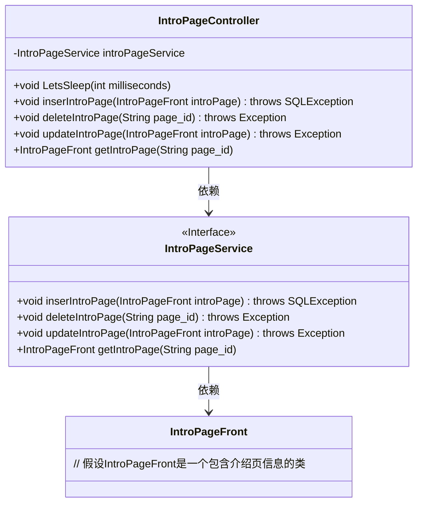
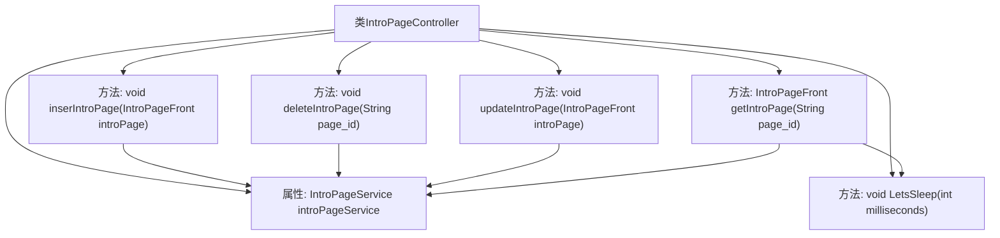

# 基础信息

|      |      |
|------|------|
| 编码语言 | .java |
| 代码路径 | boat-house-backend/src/product-service/api/src/main/java/com/idcf/boathouse/product/controller/IntroPageController.java |
| 包名 | com.idcf.boathouse.product.controller |
| 依赖项 | ['com.idcf.boathouse.product.models.IntroPageFront', 'com.idcf.boathouse.product.services.IntroPageService', 'io.swagger.annotations.Api', 'io.swagger.annotations.ApiOperation', 'org.springframework.beans.factory.annotation.Autowired', 'org.springframework.web.bind.annotation', 'java.sql.SQLException'] |
| 概述说明 | 控制器管理船坞故事接口，实现增删改查功能。 |

# 说明

控制器负责管理船坞故事接口，提供对介绍页内容的增删改查功能。该控制器允许用户创建新的介绍页内容，删除不再需要的内容，更新现有内容的详细信息，以及查询和检索特定的介绍页信息。通过这些操作，用户可以有效地管理和维护船坞故事的相关介绍内容，确保信息的准确性和及时性。

# 类列表 Class Summary

| 名称   | 类型  | 说明 |
|-------|------|-------------|
| IntroPageController | class | 控制器处理船坞故事接口，支持增删改查介绍页内容。 |

## 类 IntroPageController

|      |      |
|------|------|
| 访问范围 | @RestController;//@Api(tags = "Boat House Introduce API");@Api(tags = "船坞故事接口");//@RequestMapping("/Intro/*");@RequestMapping("/intro/*");public |
| 类型 | class |
| 名称 | IntroPageController |
| 说明 | 控制器处理船坞故事接口，支持增删改查介绍页内容。 |

### UML类图

这段代码定义了一个名为 `IntroPageController` 的控制器类，用于处理与介绍页相关的HTTP请求。该类依赖于 `IntroPageService` 接口来执行具体的业务逻辑，如插入、删除、更新和获取介绍页内容。`IntroPageService` 接口定义了这些方法的具体签名，而 `IntroPageFront` 类则用于表示介绍页的数据结构。控制器类中的 `LetsSleep` 方法用于模拟延迟操作。整体设计符合MVC架构，控制器负责处理请求并调用服务层的方法。

### 内部方法调用关系图

这段代码定义了一个名为`IntroPageController`的Spring Boot控制器类，用于管理船坞故事的介绍页内容。类中包含四个主要的请求处理方法：`inserIntroPage`用于添加介绍页内容，`deleteIntroPage`用于删除介绍页内容，`updateIntroPage`用于更新介绍页内容，`getIntroPage`用于根据ID获取介绍页内容。这些方法都依赖于`IntroPageService`类提供的服务。此外，类中还包含一个私有的辅助方法`LetsSleep`，用于在获取介绍页内容时模拟延迟。

### 字段列表 Field List

| 名称  | 类型  | 说明 |
|-------|-------|------|
| introPageService | IntroPageService | 自动注入IntroPageService服务实例。 |

### 方法列表 Method List

| 名称  | 类型  | 说明 |
|-------|-------|------|
| updateIntroPage | void | PUT请求更新介绍页内容，返回JSON格式数据。 |
| LetsSleep | void | 该方法使当前线程休眠指定毫秒，捕获中断异常并恢复中断状态。 |
| deleteIntroPage | void | 删除指定ID的介绍页内容，返回JSON格式数据。 |
| inserIntroPage | void | 后端方法用于通过POST请求添加介绍页内容，并返回JSON格式数据。 |
| getIntroPage | IntroPageFront | 通过ID获取介绍页的GET请求，返回JSON格式数据。 |

