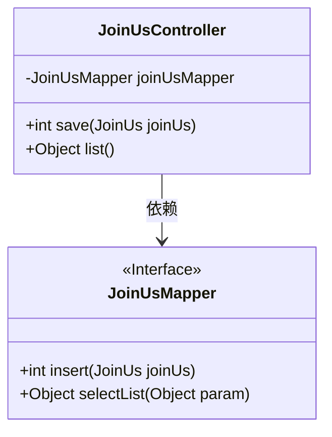
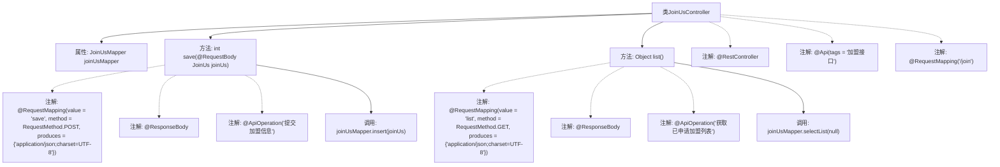

# 基础信息

|      |      |
|------|------|
| 编码语言 | .java |
| 代码路径 | boat-house-backend/src/product-service/api/src/main/java/com/idcf/boathouse/product/controller/JoinUsController.java |
| 包名 | com.idcf.boathouse.product.controller |
| 依赖项 | ['com.idcf.boathouse.product.mapper.JoinUsMapper', 'com.idcf.boathouse.product.models.JoinUs', 'io.swagger.annotations.Api', 'io.swagger.annotations.ApiOperation', 'org.springframework.web.bind.annotation', 'javax.annotation.Resource'] |
| 概述说明 | 加盟接口控制器支持提交信息和获取列表功能。 |

# 说明

加盟接口控制器是一个功能模块，主要负责处理与加盟相关的操作。它提供了两个核心功能：一是允许用户提交加盟信息，通过该功能，用户可以将自己的加盟申请数据发送至系统；二是支持获取加盟列表，用户可以通过此功能查询当前所有加盟信息的列表。该控制器通过接口实现，确保数据的高效传输和处理，为加盟流程提供了便捷的数字化支持。

# 类列表 Class Summary

| 名称   | 类型  | 说明 |
|-------|------|-------------|
| JoinUsController | class | 加盟接口控制器，提供提交加盟信息和获取加盟列表功能。 |

## 类 JoinUsController

|      |      |
|------|------|
| 访问范围 | @RestController;@Api(tags = "加盟接口");@RequestMapping("/join");public |
| 类型 | class |
| 名称 | JoinUsController |
| 说明 | 加盟接口控制器，提供提交加盟信息和获取加盟列表功能。 |

### UML类图

类图描述：
`JoinUsController` 是一个控制器类，负责处理与加盟相关的HTTP请求。它依赖于 `JoinUsMapper` 接口，该接口定义了数据访问层的操作方法。`JoinUsController` 提供了两个主要方法：`save` 用于保存加盟信息，`list` 用于获取已申请加盟的列表。`JoinUsMapper` 接口则提供了数据插入和查询的功能，`insert` 方法用于插入加盟信息，`selectList` 方法用于查询加盟列表。

### 内部方法调用关系图

这段代码定义了一个名为`JoinUsController`的Spring Boot控制器类，用于处理加盟相关的请求。类中包含两个主要方法：`save`用于提交加盟信息，`list`用于获取已申请加盟的列表。`save`方法通过`joinUsMapper.insert(joinUs)`将加盟信息插入数据库，而`list`方法通过`joinUsMapper.selectList(null)`获取所有加盟信息。类中使用了多个注解来定义REST API的行为和元数据，如`@RestController`、`@RequestMapping`、`@ResponseBody`和`@ApiOperation`等。

### 字段列表 Field List

| 名称  | 类型  | 说明 |
|-------|-------|------|
| joinUsMapper | JoinUsMapper | 声明了一个私有变量joinUsMapper，类型为JoinUsMapper。 |

### 方法列表 Method List

| 名称  | 类型  | 说明 |
|-------|-------|------|
| list | Object | 获取加盟列表的GET请求，返回JSON格式数据。 |
| save | int | 处理POST请求，提交加盟信息并返回插入结果。 |

