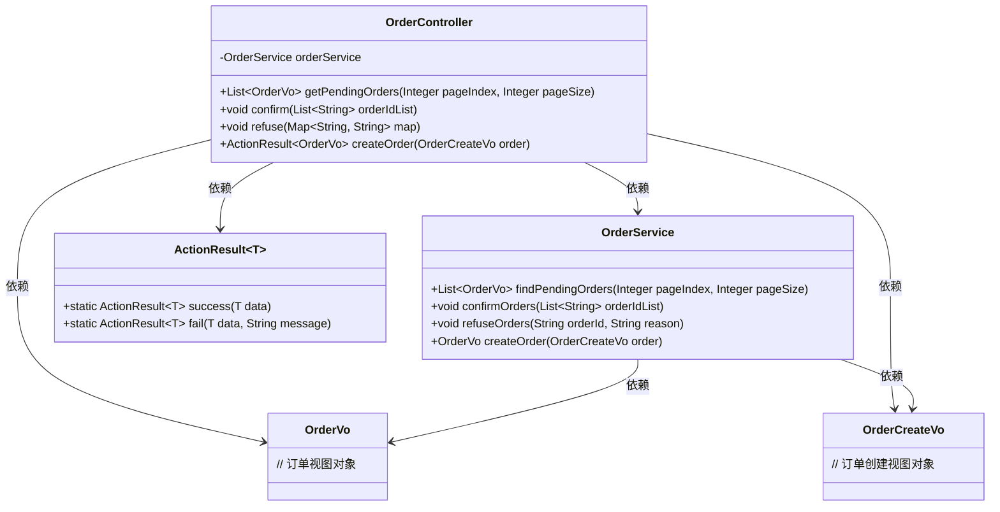
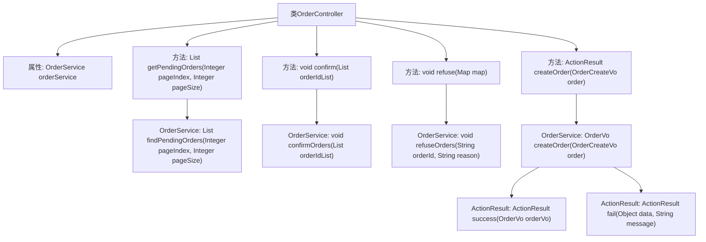

# 基础信息

|      |      |
|------|------|
| 编码语言 | .java |
| 代码路径 | boat-house-backend/src/product-service/api/src/main/java/com/idcf/boathouse/product/controller/OrderController.java |
| 包名 | com.idcf.boathouse.product.controller |
| 依赖项 | ['com.idcf.boathouse.product.services.OrderService', 'com.idcf.boathouse.product.untils.ActionResult', 'com.idcf.boathouse.product.vo.OrderCreateVo', 'com.idcf.boathouse.product.vo.OrderVo', 'io.swagger.annotations.Api', 'io.swagger.annotations.ApiOperation', 'org.springframework.beans.factory.annotation.Autowired', 'org.springframework.validation.annotation.Validated', 'org.springframework.web.bind.annotation', 'javax.validation.constraints.Positive', 'java.util.List', 'java.util.Map'] |
| 概述说明 | 订单控制器支持查询、接单、拒单和创建订单功能。 |

# 说明

订单控制器是一个提供多种功能的接口集合，主要包括查询订单、接单、拒单和创建订单。这些功能涵盖了订单管理的主要操作，使用户能够方便地进行订单的查询、接收、拒绝和创建，从而有效管理订单流程。

# 类列表 Class Summary

| 名称   | 类型  | 说明 |
|-------|------|-------------|
| OrderController | class | 订单控制器提供查询、接单、拒单和创建订单的接口。 |

## 类 OrderController

|      |      |
|------|------|
| 访问范围 | @RestController;@Validated;@Api(tags = "订单接口");@RequestMapping("/orders/*");public |
| 类型 | class |
| 名称 | OrderController |
| 说明 | 订单控制器提供查询、接单、拒单和创建订单的接口。 |

### UML类图

该代码展示了一个订单管理系统的控制器类 `OrderController`，它通过 `OrderService` 处理订单的查询、确认、拒绝和创建操作。`OrderController` 类依赖于 `OrderService` 来执行业务逻辑，并返回 `OrderVo` 和 `ActionResult<OrderVo>` 类型的结果。代码中还定义了 `OrderCreateVo` 和 `ActionResult<T>` 类，分别用于订单创建请求和操作结果的封装。整体设计符合RESTful API的规范，并使用了Swagger进行API文档生成。

### 内部方法调用关系图

这段代码是一个基于Spring Boot的RESTful API控制器，主要用于处理订单相关的操作。它包含了四个主要方法：`getPendingOrders`用于查询未接单的订单列表，`confirm`用于商户接单操作，`refuse`用于商户拒单操作，`createOrder`用于客户下单操作。每个方法都调用了`OrderService`中的相应方法来完成具体的业务逻辑。代码中还使用了Swagger注解来生成API文档，并通过`@Validated`注解对请求参数进行验证。

### 字段列表 Field List

| 名称  | 类型  | 说明 |
|-------|-------|------|
| orderService | OrderService | 使用@Autowired注解自动注入OrderService实例。 |

### 方法列表 Method List

| 名称  | 类型  | 说明 |
|-------|-------|------|
| createOrder | ActionResult<OrderVo> | POST请求处理客户下单，返回JSON格式结果。 |
| getPendingOrders | List<OrderVo> | 查询商户未接单订单列表的GET接口，支持分页，默认每页20条。 |
| refuse | void | 商户拒单接口，接收订单ID和原因，调用拒单服务。 |
| confirm | void | PUT方法处理商户接单请求，接收订单ID列表并调用服务确认。 |

