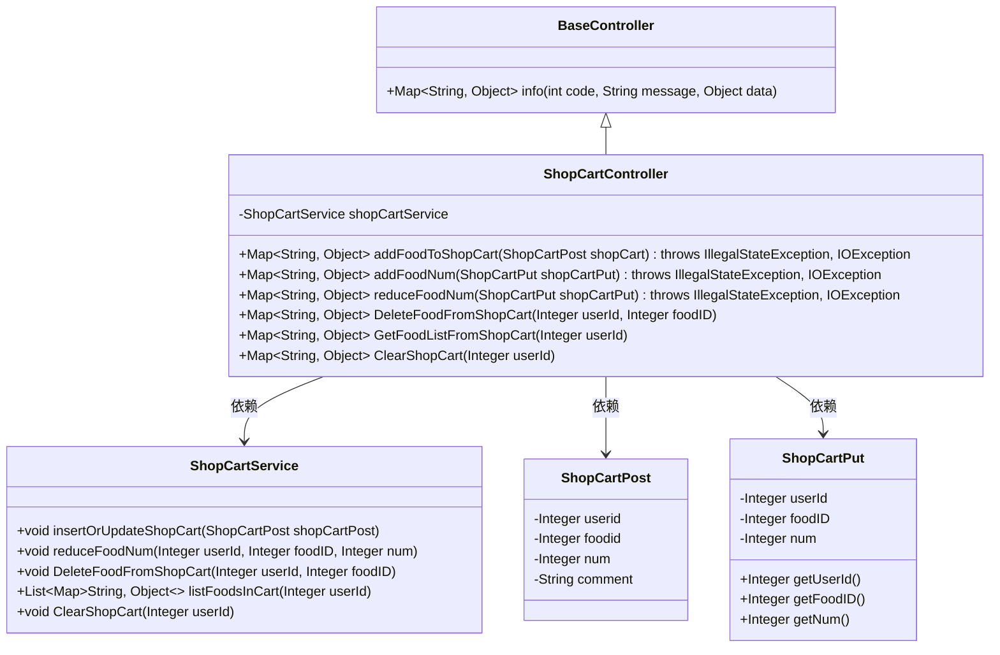
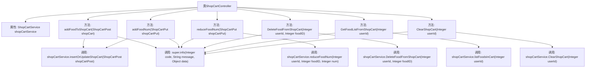

# 基础信息

|      |      |
|------|------|
| 编码语言 | .java |
| 代码路径 | boat-house-backend/src/product-service/api/src/main/java/com/idcf/boathouse/product/controller/ShopCartController.java |
| 包名 | com.idcf.boathouse.product.controller |
| 依赖项 | ['com.idcf.boathouse.product.models.ShopCartPost', 'com.idcf.boathouse.product.models.ShopCartPut', 'com.idcf.boathouse.product.services.ShopCartService', 'io.swagger.annotations.Api', 'io.swagger.annotations.ApiOperation', 'org.springframework.beans.factory.annotation.Autowired', 'org.springframework.web.bind.annotation', 'java.io.IOException', 'java.util.List', 'java.util.Map'] |
| 概述说明 | ShopCartController实现购物车功能，支持菜品增删改查及清空操作。 |

# 说明

ShopCartController实现了购物车的核心功能，支持多种操作，包括添加菜品、增减菜品数量、删除菜品、获取购物车内容以及清空购物车。这些功能确保了用户能够方便地管理购物车中的菜品，提升了购物体验的便捷性和灵活性。

# 类列表 Class Summary

| 名称   | 类型  | 说明 |
|-------|------|-------------|
| ShopCartController | class | ShopCartController实现购物车功能，支持添加、增减、删除、获取和清空菜品操作。 |

## 类 ShopCartController

|      |      |
|------|------|
| 访问范围 | @RestController;@Api(tags = "Boat House ShopCart API");@RequestMapping("/BoatHouse/*");public |
| 类型 | class |
| 名称 | ShopCartController |
| 说明 | ShopCartController实现购物车功能，支持添加、增减、删除、获取和清空菜品操作。 |

### UML类图

**描述：**  
`ShopCartController` 是一个基于Spring的REST控制器，负责处理购物车相关的请求。它继承自`BaseController`，并依赖于`ShopCartService`来执行具体的业务逻辑。控制器提供了添加、更新、删除、获取购物车菜品列表以及清空购物车的功能。`ShopCartPost`和`ShopCartPut`是数据传输对象，分别用于POST和PUT请求中的数据传递。`ShopCartService`接口定义了购物车操作的具体方法，如插入或更新购物车、减少菜品数量、删除菜品、获取购物车列表和清空购物车。

### 内部方法调用关系图

这段代码是一个基于Spring Boot的REST控制器，用于管理购物车中的菜品。它提供了添加、增加数量、减少数量、删除、获取列表和清空购物车的功能。每个方法都通过调用`shopCartService`的相应方法来处理业务逻辑，并返回统一的响应格式。流程图展示了类结构、方法调用关系以及它们之间的依赖关系。

### 字段列表 Field List

| 名称  | 类型  | 说明 |
|-------|-------|------|
| shopCartService | ShopCartService | 自动注入购物车服务实例。 |

### 方法列表 Method List

| 名称  | 类型  | 说明 |
|-------|-------|------|
| addFoodToShopCart | Map<String, Object> | POST请求添加菜品到购物车，返回成功信息。 |
| reduceFoodNum | Map<String, Object> | PUT请求减少购物车菜品数量，返回JSON格式结果。 |
| addFoodNum | Map<String, Object> | PUT请求增加购物车菜品数量，返回JSON格式结果。 |
| GetFoodListFromShopCart | Map<String, Object> | 通过GET请求获取用户购物车菜品列表，返回JSON格式数据。 |
| ClearShopCart | Map<String, Object> | 清空购物车接口，接收用户ID，返回成功信息。 |
| DeleteFoodFromShopCart | Map<String, Object> | 通过PUT请求从购物车删除指定菜品，返回成功信息。 |

