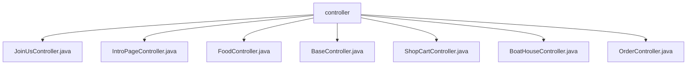

# 基础信息

|      |      |
|------|------|
| 编码语言 | .java |
| 代码路径 | boat-house-backend/src/product-service/api/src/main/java/com/idcf/boathouse/product/controller |
| 包名 | boat-house-backend.src.product-service.api.src.main.java.com.idcf.boathouse.product.controller |
| 概述说明 | 加盟接口控制器处理加盟申请和列表查询。船坞故事接口控制器管理介绍页内容。Boat House Food API控制器管理菜品数据。BaseController定义状态码和信息返回方法。ShopCartController实现购物车功能。BoatHouseController管理菜品分类。订单控制器处理订单查询、接单、拒单和创建。 |

# 说明

加盟接口控制器处理加盟相关操作，支持提交加盟信息和获取加盟列表。船坞故事接口控制器管理介绍页内容的增删改查。Boat House Food API控制器管理菜品数据，支持增删改查和模糊查询。BaseController类定义状态码并提供封装操作结果的方法。ShopCartController实现购物车功能，支持添加、增减、删除、获取和清空菜品。BoatHouseController提供菜品分类的增删改查API，使用JDBC与数据库交互。订单控制器提供查询、接单、拒单和创建订单功能，管理订单流程。

### 包内部结构视图

该流程图展示了 `controller` 文件夹与其内部文件的层级关系。`controller` 作为根节点，包含了多个控制器类文件，如 `JoinUsController.java`、`IntroPageController.java`、`FoodController.java` 等。这些文件都直接隶属于 `controller` 文件夹，没有进一步的子目录结构。

# 文件列表 File List

| 名称   | 类型  | 说明 |
|-------|------|-------------|
| [OrderController.java](OrderController.md) | file | 订单控制器支持查询、接单、拒单和创建订单功能。 |
| [BoatHouseController.java](BoatHouseController.md) | file | BoatHouseController提供菜品分类的增删改查API，使用JDBC操作数据库。 |
| [ShopCartController.java](ShopCartController.md) | file | ShopCartController实现购物车功能，支持菜品增删改查及清空操作。 |
| [BaseController.java](BaseController.md) | file | BaseController定义CODE_OK和CODE_ERROR，提供info方法返回错误码、消息和数据的Map。 |
| [FoodController.java](FoodController.md) | file | Boat House Food API控制器支持菜品增删改查及模糊查询。 |
| [IntroPageController.java](IntroPageController.md) | file | 控制器管理船坞故事接口，实现增删改查功能。 |
| [JoinUsController.java](JoinUsController.md) | file | 加盟接口控制器支持提交信息和获取列表功能。 |

