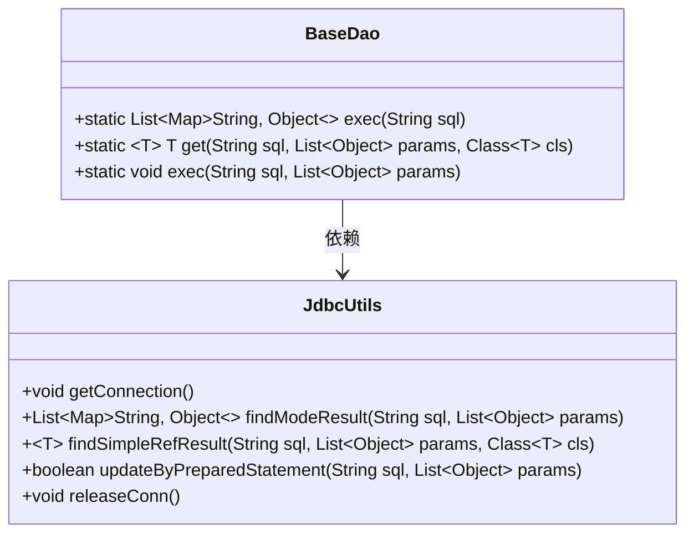

# 基础信息

|      |      |
|------|------|
| 编码语言 | .java |
| 代码路径 | boat-house-backend/src/product-service/api/src/main/java/com/idcf/boathouse/product/dao/BaseDao.java |
| 包名 | com.idcf.boathouse.product.dao |
| 依赖项 | ['java.sql.SQLException', 'java.util.List', 'java.util.Map', 'com.idcf.boathouse.product.JdbcUtils'] |
| 概述说明 | BaseDao类通过JdbcUtils管理数据库连接，支持查询、获取对象和更新操作。 |

# 说明

BaseDao类是一个提供SQL执行功能的工具类，主要用于执行数据库查询、获取对象和更新操作。该类通过JdbcUtils来管理数据库连接，确保数据库操作的连接资源得到有效管理。BaseDao的设计使得数据库操作更加简洁和高效，适用于需要频繁进行数据库交互的应用场景。通过封装底层数据库操作，BaseDao简化了开发人员的工作，提高了代码的可维护性和可读性。

# 类列表 Class Summary

| 名称   | 类型  | 说明 |
|-------|------|-------------|
| BaseDao | class | BaseDao类提供SQL执行功能，包括查询、获取对象和更新操作，使用JdbcUtils管理数据库连接。 |

## 类 BaseDao

|      |      |
|------|------|
| 访问范围 | public |
| 类型 | class |
| 名称 | BaseDao |
| 说明 | BaseDao类提供SQL执行功能，包括查询、获取对象和更新操作，使用JdbcUtils管理数据库连接。 |

### UML类图

**描述：**  
`BaseDao` 类是一个数据访问对象，提供了执行SQL查询和更新的方法。它依赖于 `JdbcUtils` 类来管理数据库连接和执行SQL操作。`exec` 方法用于执行查询并返回结果集，`get` 方法用于执行查询并返回单个对象，`exec` 方法用于执行更新操作。`JdbcUtils` 类封装了数据库连接、查询执行和资源释放的逻辑。

### 内部方法调用关系图

```mermaid
graph TD
    A["类BaseDao"]
    B["方法: exec(String sql)"]
    C["方法: get(String sql, List<Object> params, Class<T> cls)"]
    D["方法: exec(String sql, List<Object> params)"]
    E["创建JdbcUtils对象"]
    F["获取数据库连接: jdbcUtils.getConnection()"]
    G["执行SQL查询: jdbcUtils.findModeResult(sql, null)"]
    H["输出查询结果: System.out.println(list)"]
    I["释放数据库连接: jdbcUtils.releaseConn()"]
    J["捕获SQLException: e.printStackTrace()"]
    K["返回查询结果: return list"]
    L["执行SQL查询: jdbcUtils.findSimpleRefResult(sql, params, cls)"]
    M["输出类信息: System.out.print(cls)"]
    N["返回查询结果: return t"]
    O["捕获Exception: e.printStackTrace()"]
    P["执行SQL更新: jdbcUtils.updateByPreparedStatement(sql, params)"]
    Q["输出更新结果: System.out.println(flag)"]

    A --> B
    A --> C
    A --> D
    B --> E
    B --> F
    B --> G
    B --> H
    B --> I
    B --> J
    B --> K
    C --> E
    C --> F
    C --> L
    C --> M
    C --> I
    C --> N
    C --> J
    C --> O
    D --> E
    D --> F
    D --> P
    D --> Q
    D --> I
    D --> J
```

这段代码定义了一个名为`BaseDao`的类，包含了三个静态方法：`exec(String sql)`、`get(String sql, List<Object> params, Class<T> cls)`和`exec(String sql, List<Object> params)`。这些方法主要用于执行SQL查询和更新操作，并通过`JdbcUtils`类与数据库进行交互。每个方法都包含获取数据库连接、执行SQL语句、处理异常和释放数据库连接的步骤。流程图清晰地展示了各个方法的执行流程及其内部调用关系。

### 字段列表 Field List

| 名称  | 类型  | 说明 |
|-------|-------|------|

### 方法列表 Method List

| 名称  | 类型  | 说明 |
|-------|-------|------|
| get | T | 静态方法通过SQL和参数列表获取指定类型对象，处理异常并释放连接。 |
| exec | List<Map<String, Object>> | 静态方法执行SQL查询并返回结果列表，处理异常并释放连接。 |
| exec | void | 静态方法执行SQL更新，连接数据库，输出结果并释放连接。 |

