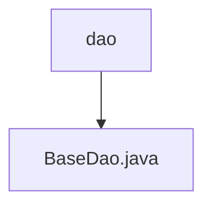

# 基础信息

|      |      |
|------|------|
| 编码语言 | .java |
| 代码路径 | boat-house-backend/src/product-service/api/src/main/java/com/idcf/boathouse/product/dao |
| 包名 | boat-house-backend.src.product-service.api.src.main.java.com.idcf.boathouse.product.dao |
| 概述说明 | BaseDao类通过JdbcUtils管理数据库连接，支持查询、获取对象和更新操作。 |

# 说明

BaseDao类是一个提供SQL执行功能的工具类，主要用于执行数据库查询、获取对象和更新操作。该类通过JdbcUtils来管理数据库连接，确保数据库操作的连接资源得到有效管理。BaseDao的设计使得数据库操作更加简洁和高效，适用于需要频繁进行数据库交互的应用场景。通过封装底层数据库操作，BaseDao简化了开发人员的工作，提高了代码的可维护性和可读性。

### 包内部结构视图

流程图描述：该流程图展示了`boat-house-backend`项目中`product-service`模块的`dao`目录结构。`dao`目录下包含一个`BaseDao.java`文件，表示该文件是`dao`目录的直接子节点。整体结构简洁明了，符合路径的层级关系。

# 文件列表 File List

| 名称   | 类型  | 说明 |
|-------|------|-------------|
| [BaseDao.java](BaseDao.md) | file | BaseDao类通过JdbcUtils管理数据库连接，支持查询、获取对象和更新操作。 |

