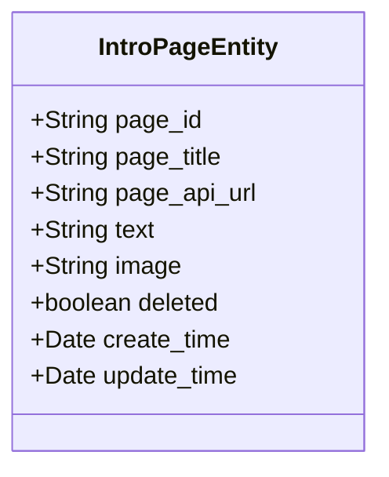
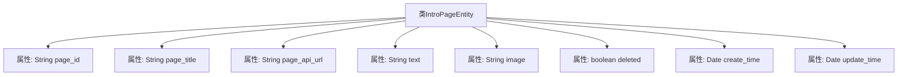

# 基础信息

|      |      |
|------|------|
| 编码语言 | .java |
| 代码路径 | boat-house-backend/src/product-service/api/src/main/java/com/idcf/boathouse/product/dbentity/IntroPageEntity.java |
| 包名 | com.idcf.boathouse.product.dbentity |
| 依赖项 | ['java.util.Date'] |
| 概述说明 | IntroPageEntity类包含页面ID、标题、API链接、文本、图片、删除状态及创建更新时间。 |

# 说明

IntroPageEntity类是一个用于管理页面信息的实体类，包含多个关键属性。其中包括页面ID用于唯一标识页面，标题用于显示页面名称，API链接用于访问相关接口，文本用于存储页面内容，图片用于展示页面图像，删除状态用于标识页面是否被删除，以及创建和更新时间用于记录页面的生命周期。这些属性共同构成了页面信息的完整描述。

# 类列表 Class Summary

| 名称   | 类型  | 说明 |
|-------|------|-------------|
| IntroPageEntity | class | IntroPageEntity类包含页面ID、标题、API链接、文本、图片、删除状态及创建更新时间。 |

## 类 IntroPageEntity

|      |      |
|------|------|
| 访问范围 | public |
| 类型 | class |
| 名称 | IntroPageEntity |
| 说明 | IntroPageEntity类包含页面ID、标题、API链接、文本、图片、删除状态及创建更新时间。 |

### UML类图

这段代码定义了一个名为 `IntroPageEntity` 的类，用于表示一个介绍页面的实体。类中包含了多个公有字段，分别用于存储页面的唯一标识 `page_id`、页面标题 `page_title`、API 地址 `page_api_url`、页面文本内容 `text`、图片地址 `image`、删除状态 `deleted`、创建时间 `create_time` 和更新时间 `update_time`。这些字段均为公有属性，允许外部直接访问和修改。该类主要用于存储和管理介绍页面的相关信息。

### 内部方法调用关系图

这段代码定义了一个名为 `IntroPageEntity` 的类，该类包含多个属性，用于存储与介绍页面相关的信息。这些属性包括页面的唯一标识符 `page_id`、页面标题 `page_title`、API 地址 `page_api_url`、页面文本内容 `text`、页面图片 `image`、删除状态 `deleted`、创建时间 `create_time` 和更新时间 `update_time`。这些属性共同构成了一个完整的介绍页面实体，用于在系统中表示和管理介绍页面的数据。

### 字段列表 Field List

| 名称  | 类型  | 说明 |
|-------|-------|------|
| page_id | String | 定义一个字符串类型的变量page_id。 |
| deleted | boolean | 布尔类型变量deleted表示删除状态。 |
| update_time | Date | 更新时间的公共日期变量。 |
| page_api_url | String | 定义公共字符串变量page_api_url。 |
| page_title | String | 定义一个名为page_title的公共字符串变量。 |
| image | String | 定义一个公开的字符串变量image。 |
| create_time | Date | 定义了一个名为create_time的Date类型公共变量。 |
| text | String | 定义了一个名为text的公共字符串变量。 |

### 方法列表 Method List

| 名称  | 类型  | 说明 |
|-------|-------|------|

