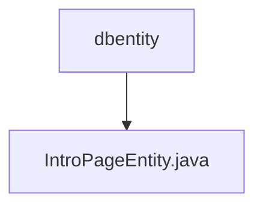

# 基础信息

|      |      |
|------|------|
| 编码语言 | .java |
| 代码路径 | boat-house-backend/src/product-service/api/src/main/java/com/idcf/boathouse/product/dbentity |
| 包名 | boat-house-backend.src.product-service.api.src.main.java.com.idcf.boathouse.product.dbentity |
| 概述说明 | IntroPageEntity类包含页面ID、标题、API链接、文本、图片、删除状态及创建更新时间。 |

# 说明

IntroPageEntity类是一个用于管理页面信息的实体类，包含多个关键属性。其中包括页面ID用于唯一标识页面，标题用于显示页面名称，API链接用于访问相关接口，文本用于存储页面内容，图片用于展示页面图像，删除状态用于标识页面是否被删除，以及创建和更新时间用于记录页面的生命周期。这些属性共同构成了页面信息的完整描述。

### 包内部结构视图

该流程图展示了`dbentity`文件夹与`IntroPageEntity.java`文件之间的层级关系。`dbentity`是`IntroPageEntity.java`文件的父级目录，文件位于该目录下。流程图简洁明了，清晰地反映了路径的层级结构。

# 文件列表 File List

| 名称   | 类型  | 说明 |
|-------|------|-------------|
| [IntroPageEntity.java](IntroPageEntity.md) | file | IntroPageEntity类包含页面ID、标题、API链接、文本、图片、删除状态及创建更新时间。 |

