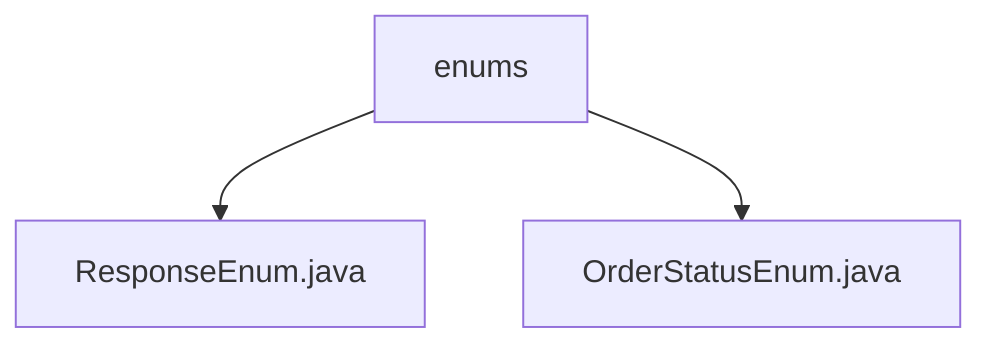

# 基础信息

|      |      |
|------|------|
| 编码语言 | .java |
| 代码路径 | boat-house-backend/src/product-service/api/src/main/java/com/idcf/boathouse/product/enums |
| 包名 | boat-house-backend.src.product-service.api.src.main.java.com.idcf.boathouse.product.enums |
| 概述说明 | 内容为空，无法生成总结描述。请提供具体信息。 |

# 说明

给定的内容为空，没有提供任何具体信息或细节。因此，无法生成总结描述。请提供具体内容以便进行准确描述。

### 包内部结构视图

该流程图展示了路径中的层级关系，`enums`文件夹下包含两个Java枚举类文件：`ResponseEnum.java`和`OrderStatusEnum.java`。通过简洁的节点关系，清晰地反映了文件在项目结构中的位置和层级。

# 文件列表 File List

| 名称   | 类型  | 说明 |
|-------|------|-------------|
| [OrderStatusEnum.java](OrderStatusEnum.md) | file | 信息为空，无法生成概要描述。 |
| [ResponseEnum.java](ResponseEnum.md) | file | 信息为空，无法生成概要描述。 |

