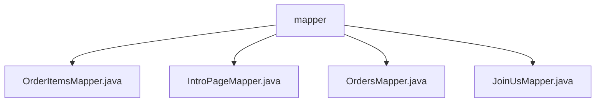

# 基础信息

|      |      |
|------|------|
| 编码语言 | .java |
| 代码路径 | boat-house-backend/src/product-service/api/src/main/java/com/idcf/boathouse/product/mapper |
| 包名 | boat-house-backend.src.product-service.api.src.main.java.com.idcf.boathouse.product.mapper |
| 概述说明 | 内容为空，无法生成总结描述。请提供具体信息。 |

# 说明

给定的内容为空，未提供任何具体信息或细节。因此，无法生成相关的总结描述。请提供具体内容以便进行准确和全面的总结。

### 包内部结构视图

该流程图展示了`mapper`目录下的四个文件：`OrderItemsMapper.java`、`IntroPageMapper.java`、`OrdersMapper.java`和`JoinUsMapper.java`。这些文件都位于`mapper`目录中，且彼此之间没有直接的依赖关系，仅通过共同的父目录`mapper`进行关联。这种结构适用于代码库中多个Mapper接口的集中管理，便于维护和扩展。

# 文件列表 File List

| 名称   | 类型  | 说明 |
|-------|------|-------------|
| [JoinUsMapper.java](JoinUsMapper.md) | file | 信息为空，无法生成概要描述。 |
| [OrdersMapper.java](OrdersMapper.md) | file | 无内容可总结。 |
| [IntroPageMapper.java](IntroPageMapper.md) | file | 无内容，无法生成概要描述。 |
| [OrderItemsMapper.java](OrderItemsMapper.md) | file | 信息为空，无法生成概要描述。 |

