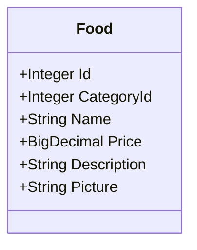
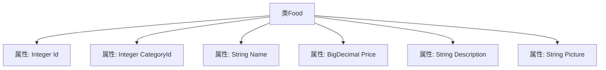

# 基础信息

|      |      |
|------|------|
| 编码语言 | .java |
| 代码路径 | boat-house-backend/src/product-service/api/src/main/java/com/idcf/boathouse/product/models/Food.java |
| 包名 | com.idcf.boathouse.product.models |
| 依赖项 | ['io.swagger.annotations.ApiModel', 'io.swagger.annotations.ApiModelProperty', 'java.math.BigDecimal', 'java.sql.Blob'] |
| 概述说明 | Food类包含菜品ID、分类ID、名称、价格、描述和图片属性。 |

# 说明

Food类是一个用于表示菜品信息的类，包含多个关键属性。这些属性包括菜品ID，用于唯一标识每个菜品；分类ID，用于将菜品归类到特定类别；名称，表示菜品的具体名称；价格，记录菜品的售价；描述，提供菜品的详细说明；图片，用于展示菜品的外观。这些属性共同构成了菜品的完整信息，便于系统管理和用户查看。

# 类列表 Class Summary

| 名称   | 类型  | 说明 |
|-------|------|-------------|
| Food | class | Food类包含菜品ID、分类ID、名称、价格、描述和图片属性。 |

## 类 Food

|      |      |
|------|------|
| 访问范围 | @ApiModel;public |
| 类型 | class |
| 名称 | Food |
| 说明 | Food类包含菜品ID、分类ID、名称、价格、描述和图片属性。 |

### UML类图

这段代码定义了一个名为 `Food` 的类，用于表示菜品信息。类中包含多个公有属性，分别表示菜品的ID、分类ID、名称、价格、描述和图片。这些属性通过 `@ApiModelProperty` 注解进行描述，用于生成API文档。代码结构简单，主要用于数据模型的表示和传输。

### 内部方法调用关系图

这段代码定义了一个名为 `Food` 的类，该类包含六个属性：`Id`、`CategoryId`、`Name`、`Price`、`Description` 和 `Picture`。每个属性都使用了 `@ApiModelProperty` 注解来提供属性的描述信息。`Id` 和 `CategoryId` 是整数类型，`Name`、`Description` 和 `Picture` 是字符串类型，`Price` 是 `BigDecimal` 类型。这个类通常用于表示一个菜品的详细信息，适用于API文档生成或数据模型的描述。

### 字段列表 Field List

| 名称  | 类型  | 说明 |
|-------|-------|------|
| Id | Integer | 菜品ID字段，类型为整数。 |
| CategoryId | Integer | 菜品分类ID为整型数据。 |
| Name | String | 菜品名称字段定义。 |
| Picture | String | 菜品图片字段用于存储菜品相关图片信息。 |
| Price | BigDecimal | 菜品价格字段定义为BigDecimal类型。 |
| Description | String | 菜品描述字段用于存储菜品的详细信息。 |

### 方法列表 Method List

| 名称  | 类型  | 说明 |
|-------|-------|------|

