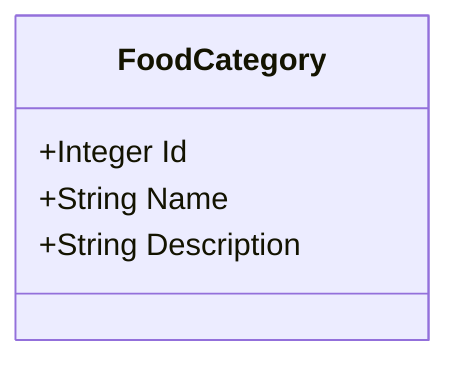
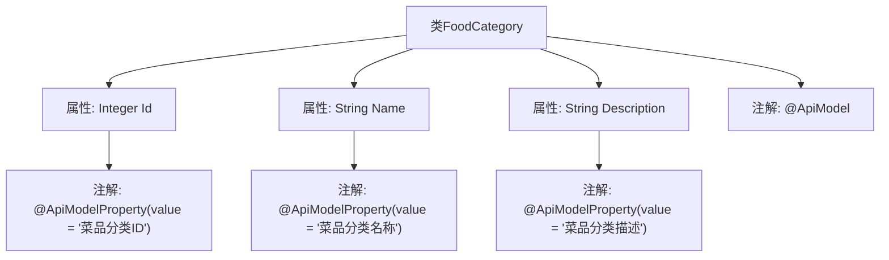

# 基础信息

|      |      |
|------|------|
| 编码语言 | .java |
| 代码路径 | boat-house-backend/src/product-service/api/src/main/java/com/idcf/boathouse/product/models/FoodCategory.java |
| 包名 | com.idcf.boathouse.product.models |
| 依赖项 | ['io.swagger.annotations.ApiModel', 'io.swagger.annotations.ApiModelProperty'] |
| 概述说明 | FoodCategory类包含菜品分类ID、名称和描述。 |

# 说明

FoodCategory类用于表示菜品分类信息，包含三个主要属性：菜品分类ID、名称和描述。菜品分类ID用于唯一标识每个分类，名称表示分类的具体名称，描述则提供了对该分类的详细说明。这些属性共同构成了菜品分类的基本数据结构，便于在系统中进行管理和查询。

# 类列表 Class Summary

| 名称   | 类型  | 说明 |
|-------|------|-------------|
| FoodCategory | class | FoodCategory类包含菜品分类ID、名称和描述。 |

## 类 FoodCategory

|      |      |
|------|------|
| 访问范围 | @ApiModel;public |
| 类型 | class |
| 名称 | FoodCategory |
| 说明 | FoodCategory类包含菜品分类ID、名称和描述。 |

### UML类图

这段代码定义了一个名为 `FoodCategory` 的类，用于表示菜品分类。类中包含三个公有属性：`Id`（菜品分类ID）、`Name`（菜品分类名称）和 `Description`（菜品分类描述）。这些属性通过 `@ApiModelProperty` 注解进行描述，表明它们在不同的API模型中的用途。该类主要用于数据模型的表示，便于在API中传递和处理菜品分类信息。

### 内部方法调用关系图

这段代码定义了一个名为`FoodCategory`的类，该类包含三个属性：`Id`、`Name`和`Description`。每个属性都使用了`@ApiModelProperty`注解来描述其含义，其中`Id`表示菜品分类的ID，`Name`表示菜品分类的名称，`Description`表示菜品分类的描述。整个类还使用了`@ApiModel`注解，表明它是一个API模型类。该代码主要用于定义菜品分类的数据结构，便于在API中进行数据传输和描述。

### 字段列表 Field List

| 名称  | 类型  | 说明 |
|-------|-------|------|
| Id | Integer | 菜品分类ID字段定义。 |
| Description | String | 菜品分类描述字段。 |
| Name | String | 菜品分类名称字段定义。 |

### 方法列表 Method List

| 名称  | 类型  | 说明 |
|-------|-------|------|

