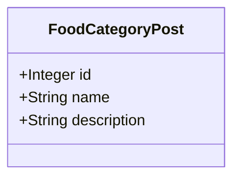
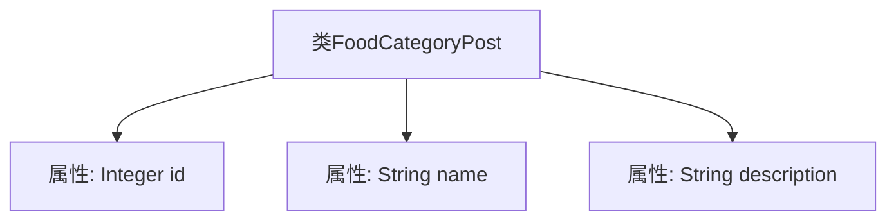

# 基础信息

|      |      |
|------|------|
| 编码语言 | .java |
| 代码路径 | boat-house-backend/src/product-service/api/src/main/java/com/idcf/boathouse/product/models/FoodCategoryPost.java |
| 包名 | com.idcf.boathouse.product.models |
| 依赖项 | [] |
| 概述说明 | FoodCategoryPost类包含id、名称和描述三个属性。 |

# 说明

FoodCategoryPost类是一个包含三个主要属性的数据结构。这些属性分别是id、name和description。id属性用于唯一标识每个FoodCategoryPost实例，name属性用于存储该实例的名称，description属性则用于提供关于该实例的详细描述。这种结构设计有助于在软件系统中有效管理和组织与食品类别相关的信息。

# 类列表 Class Summary

| 名称   | 类型  | 说明 |
|-------|------|-------------|
| FoodCategoryPost | class | FoodCategoryPost类包含id、name和description三个属性。 |

## 类 FoodCategoryPost

|      |      |
|------|------|
| 访问范围 | public |
| 类型 | class |
| 名称 | FoodCategoryPost |
| 说明 | FoodCategoryPost类包含id、name和description三个属性。 |

### UML类图

这段代码定义了一个名为 `FoodCategoryPost` 的类，用于表示食物类别的帖子信息。该类包含三个公有属性：`id`、`name` 和 `description`，分别用于存储食物类别的唯一标识、名称和描述。这个类主要用于封装与食物类别相关的数据，方便在程序中进行管理和操作。

### 内部方法调用关系图

这段代码定义了一个名为 `FoodCategoryPost` 的类，包含三个属性：`id`（整数类型）、`name`（字符串类型）和 `description`（字符串类型）。该类没有定义任何方法，仅用于存储与食品类别相关的数据。通过流程图可以清晰地看到类的结构及其属性之间的关系。

### 字段列表 Field List

| 名称  | 类型  | 说明 |
|-------|-------|------|
| name | String | 定义一个名为name的公共字符串变量。 |
| id | Integer | 定义一个名为id的公共整型变量。 |
| description | String | 定义了一个公共字符串变量`description`。 |

### 方法列表 Method List

| 名称  | 类型  | 说明 |
|-------|-------|------|

