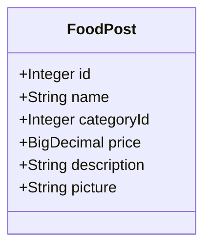
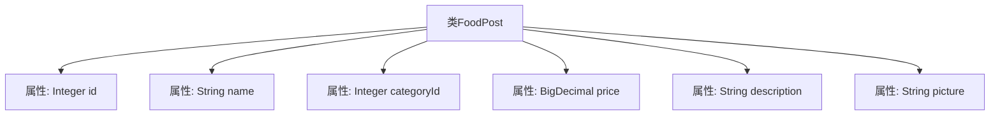

# 基础信息

|      |      |
|------|------|
| 编码语言 | .java |
| 代码路径 | boat-house-backend/src/product-service/api/src/main/java/com/idcf/boathouse/product/models/FoodPost.java |
| 包名 | com.idcf.boathouse.product.models |
| 依赖项 | ['io.swagger.annotations.ApiModelProperty', 'java.math.BigDecimal', 'java.sql.Blob'] |
| 概述说明 | FoodPost类包含ID、名称、分类ID、价格、描述和图片字段。 |

# 说明

FoodPost类是一个用于存储食物相关信息的类，包含六个主要字段。ID字段用于唯一标识每个食物条目。名称字段记录食物的具体名称。分类ID字段用于关联食物的类别信息。价格字段存储食物的定价。描述字段提供关于食物的详细说明。图片字段用于保存食物的图像信息。这些字段共同构成了一个完整的食物信息记录，便于管理和展示。

# 类列表 Class Summary

| 名称   | 类型  | 说明 |
|-------|------|-------------|
| FoodPost | class | FoodPost类包含ID、名称、分类ID、价格、描述和图片字段。 |

## 类 FoodPost

|      |      |
|------|------|
| 访问范围 | public |
| 类型 | class |
| 名称 | FoodPost |
| 说明 | FoodPost类包含ID、名称、分类ID、价格、描述和图片字段。 |

### UML类图

这段代码定义了一个名为 `FoodPost` 的类，用于表示食品发布的信息。类中包含六个公有属性：`id`、`name`、`categoryId`、`price`、`description` 和 `picture`，分别用于存储食品的唯一标识、名称、类别ID、价格、描述和图片信息。该类没有定义任何方法，仅用于数据的封装和存储。

### 内部方法调用关系图

这段代码定义了一个名为 `FoodPost` 的类，该类包含六个公共属性：`id`、`name`、`categoryId`、`price`、`description` 和 `picture`。这些属性分别用于存储食品帖子的唯一标识、名称、类别ID、价格、描述和图片信息。该类没有定义任何方法，仅用于数据存储和传输。

### 字段列表 Field List

| 名称  | 类型  | 说明 |
|-------|-------|------|
| name | String | 定义一个名为`name`的公共字符串变量。 |
| id | Integer | 定义了一个名为id的公共整型变量。 |
| price | BigDecimal | 定义一个名为price的BigDecimal类型公共变量。 |
| description | String | 该信息表示一个公开的字符串类型变量“description”。 |
| categoryId | Integer | 定义整型变量categoryId，用于存储分类ID。 |
| picture | String | 声明一个公共字符串变量picture。 |

### 方法列表 Method List

| 名称  | 类型  | 说明 |
|-------|-------|------|

