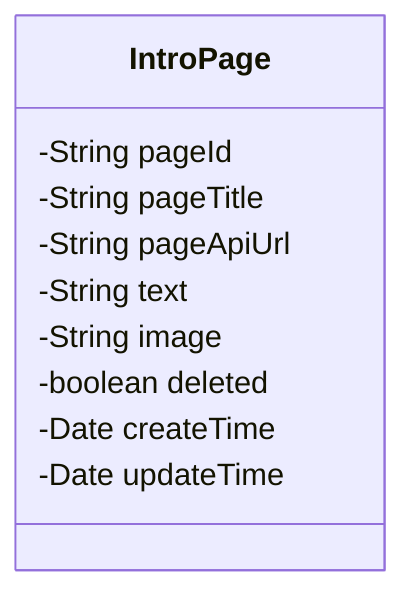
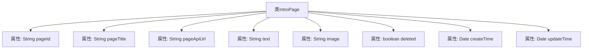

# 基础信息

|      |      |
|------|------|
| 编码语言 | .java |
| 代码路径 | boat-house-backend/src/product-service/api/src/main/java/com/idcf/boathouse/product/models/IntroPage.java |
| 包名 | com.idcf.boathouse.product.models |
| 依赖项 | ['com.baomidou.mybatisplus.annotation.FieldStrategy', 'com.baomidou.mybatisplus.annotation.TableField', 'com.baomidou.mybatisplus.annotation.TableId', 'com.baomidou.mybatisplus.annotation.TableName', 'lombok.Data', 'java.util.Date'] |
| 概述说明 | IntroPage类映射intropage表，含页面ID、标题、API地址、文本、图片、删除状态及创建更新时间字段。 |

# 说明

IntroPage类与intropage表进行映射，包含多个字段：页面ID用于唯一标识每个页面，标题描述页面名称，API地址指向相关接口，文本存储页面内容，图片存储页面图像，删除状态标识页面是否被删除，创建时间记录页面生成时间，更新时间记录页面最后修改时间。这些字段共同管理页面信息，确保数据完整性和可追溯性。

# 类列表 Class Summary

| 名称   | 类型  | 说明 |
|-------|------|-------------|
| IntroPage | class | IntroPage类映射intropage表，包含页面ID、标题、API地址、文本、图片、删除状态、创建和更新时间字段。 |

## 类 IntroPage

|      |      |
|------|------|
| 访问范围 | @Data;@TableName(value = "intropage");public |
| 类型 | class |
| 名称 | IntroPage |
| 说明 | IntroPage类映射intropage表，包含页面ID、标题、API地址、文本、图片、删除状态、创建和更新时间字段。 |

### UML类图

这段代码定义了一个名为 `IntroPage` 的类，用于表示一个介绍页面的实体。类中包含多个私有字段，分别表示页面的唯一标识 `pageId`、页面标题 `pageTitle`、API URL `pageApiUrl`、文本内容 `text`、图片 `image`、删除状态 `deleted`、创建时间 `createTime` 和更新时间 `updateTime`。这些字段通过注解与数据库表中的列进行映射，注解 `@TableId` 和 `@TableField` 分别用于标识主键和普通字段，并指定了插入策略。该类主要用于与数据库中的 `intropage` 表进行交互，存储和检索页面相关信息。

### 内部方法调用关系图

这段代码定义了一个名为 `IntroPage` 的类，该类使用了 `@Data` 注解，表示它是一个数据类，自动生成 `getter` 和 `setter` 方法。类中的属性包括 `pageId`、`pageTitle`、`pageApiUrl`、`text`、`image`、`deleted`、`createTime` 和 `updateTime`，每个属性都使用了 `@TableField` 注解来指定数据库表中的字段映射和插入策略。`@TableName` 注解则指定了该类对应的数据库表名为 `intropage`。

### 字段列表 Field List

| 名称  | 类型  | 说明 |
|-------|-------|------|
| pageApiUrl | String | 字段pageApiUrl使用默认插入策略。 |
| createTime | Date | 字段createTime使用默认插入策略，类型为Date。 |
| text | String | 实体类字段text使用默认插入策略。 |
| pageTitle | String | 定义私有字符串变量pageTitle，使用默认插入策略。 |
| pageId | String | 表主键字段为pageId。 |
| image | String | 定义私有字符串变量image，使用默认插入策略。 |
| deleted | boolean | 实体类中声明了一个布尔类型的deleted字段，使用默认插入策略。 |
| updateTime | Date | 实体类中定义了一个updateTime字段，使用DEFAULT插入策略。 |

### 方法列表 Method List

| 名称  | 类型  | 说明 |
|-------|-------|------|

