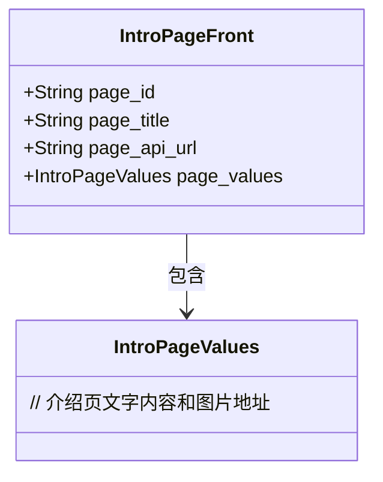
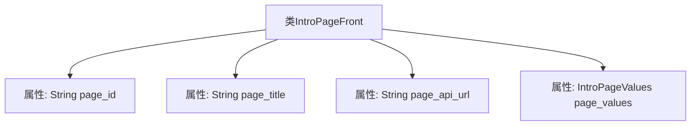

# 基础信息

|      |      |
|------|------|
| 编码语言 | .java |
| 代码路径 | boat-house-backend/src/product-service/api/src/main/java/com/idcf/boathouse/product/models/IntroPageFront.java |
| 包名 | com.idcf.boathouse.product.models |
| 依赖项 | ['io.swagger.annotations.ApiModelProperty'] |
| 概述说明 | 介绍页包含ID、标题、后台调用地址及图片信息。 |

# 说明

介绍页类包含四个主要部分：ID、标题、后台调用地址和内容图片信息。ID用于唯一标识每个介绍页，确保数据的唯一性和可追溯性。标题是介绍页的核心描述，简明扼要地概括了页面的主题或内容。后台调用地址指定了从服务器获取或提交数据的路径，确保前后端数据交互的顺畅。内容图片信息则存储了与介绍页相关的图片数据，通常包括图片的路径、名称或其他元数据，用于在页面上展示相关视觉内容。这些部分共同构成了一个完整的介绍页数据结构，便于管理和展示。

# 类列表 Class Summary

| 名称   | 类型  | 说明 |
|-------|------|-------------|
| IntroPageFront | class | 介绍页类包含ID、标题、后台调用地址及内容图片信息。 |

## 类 IntroPageFront

|      |      |
|------|------|
| 访问范围 | public |
| 类型 | class |
| 名称 | IntroPageFront |
| 说明 | 介绍页类包含ID、标题、后台调用地址及内容图片信息。 |

### UML类图

这段代码定义了一个名为 `IntroPageFront` 的类，该类包含四个公有成员变量：`page_id`、`page_title`、`page_api_url` 和 `page_values`。其中，`page_values` 是一个 `IntroPageValues` 类型的对象，用于存储介绍页的文字内容和图片地址。`IntroPageFront` 类依赖于 `IntroPageValues` 类，表示 `IntroPageFront` 类中包含 `IntroPageValues` 类的实例。

### 内部方法调用关系图

这段代码定义了一个名为`IntroPageFront`的类，该类包含四个属性：`page_id`、`page_title`、`page_api_url`和`page_values`。其中，`page_id`、`page_title`和`page_api_url`是字符串类型的属性，而`page_values`是一个`IntroPageValues`类型的属性。每个属性都使用了`@ApiModelProperty`注解来描述其用途。这个类主要用于存储介绍页的相关信息，包括ID、标题、后台调用地址以及文字内容和图片地址。

### 字段列表 Field List

| 名称  | 类型  | 说明 |
|-------|-------|------|
| page_title | String | 介绍页标题字段定义。 |
| page_values | IntroPageValues | 介绍页内容及图片地址存储在page_values中。 |
| page_api_url | String | 介绍页后台调用地址的API属性。 |
| page_id | String | 介绍页ID的API模型属性。 |

### 方法列表 Method List

| 名称  | 类型  | 说明 |
|-------|-------|------|

