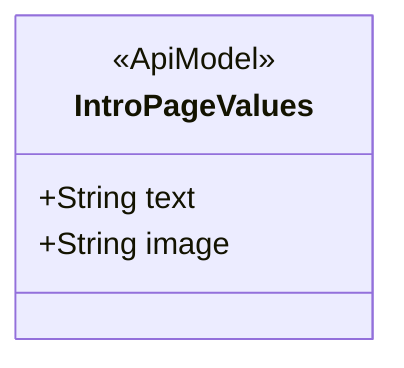
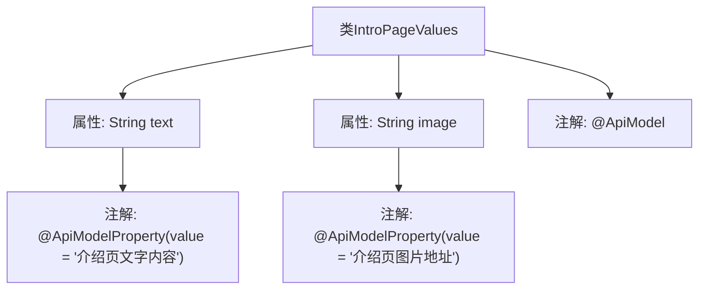

# 基础信息

|      |      |
|------|------|
| 编码语言 | .java |
| 代码路径 | boat-house-backend/src/product-service/api/src/main/java/com/idcf/boathouse/product/models/IntroPageValues.java |
| 包名 | com.idcf.boathouse.product.models |
| 依赖项 | ['io.swagger.annotations.ApiModel', 'io.swagger.annotations.ApiModelProperty'] |
| 概述说明 | API模型类包含文字内容和图片地址的介绍页。 |

# 说明

介绍页API模型类用于存储和展示文字内容及图片地址信息。该模型类包含两个主要字段：文字内容字段用于存储页面的文本描述，图片地址字段用于存储图片的URL链接。通过该模型类，用户可以方便地获取和展示介绍页的详细信息和相关图片，确保页面内容的完整性和一致性。

# 类列表 Class Summary

| 名称   | 类型  | 说明 |
|-------|------|-------------|
| IntroPageValues | class | 介绍页包含文字内容和图片地址的API模型类。 |

## 类 IntroPageValues

|      |      |
|------|------|
| 访问范围 | @ApiModel;public |
| 类型 | class |
| 名称 | IntroPageValues |
| 说明 | 介绍页包含文字内容和图片地址的API模型类。 |

### UML类图

这段代码定义了一个名为 `IntroPageValues` 的类，该类使用了 `@ApiModel` 注解，表明它是一个API模型类。类中包含两个公有成员变量：`text` 和 `image`，分别用于存储介绍页的文字内容和图片地址。`@ApiModelProperty` 注解用于描述这两个成员变量的含义，`text` 表示介绍页的文字内容，`image` 表示介绍页的图片地址。这个类主要用于在API中传递介绍页的相关信息。

### 内部方法调用关系图

这段代码定义了一个名为 `IntroPageValues` 的类，该类包含两个属性：`text` 和 `image`，分别用于存储介绍页的文字内容和图片地址。类上使用了 `@ApiModel` 注解，属性上分别使用了 `@ApiModelProperty` 注解来提供属性的描述信息。这些注解通常用于生成API文档，帮助开发者理解属性的用途。

### 字段列表 Field List

| 名称  | 类型  | 说明 |
|-------|-------|------|
| image | String | 介绍页图片地址存储在字符串变量image中。 |
| text | String | 介绍页文字内容的API模型属性。 |

### 方法列表 Method List

| 名称  | 类型  | 说明 |
|-------|-------|------|

