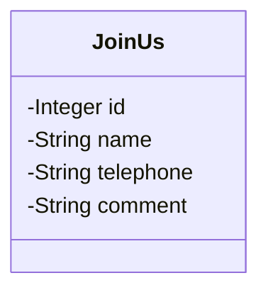
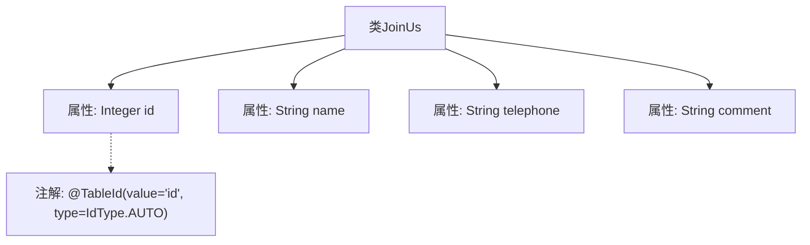

# 基础信息

|      |      |
|------|------|
| 编码语言 | .java |
| 代码路径 | boat-house-backend/src/product-service/api/src/main/java/com/idcf/boathouse/product/models/JoinUs.java |
| 包名 | com.idcf.boathouse.product.models |
| 依赖项 | ['com.baomidou.mybatisplus.annotation.IdType', 'com.baomidou.mybatisplus.annotation.TableId', 'lombok.Data'] |
| 概述说明 | JoinUs类包含id、name、telephone和comment字段，id自动生成。 |

# 说明

JoinUs类是一个包含四个字段的数据结构，用于存储相关信息。其中，id字段是自动生成的，确保每个实例具有唯一标识。name字段用于存储名称信息，telephone字段用于存储电话号码，comment字段则用于存储备注或评论内容。这些字段共同构成了JoinUs类的基本框架，便于管理和处理相关数据。

# 类列表 Class Summary

| 名称   | 类型  | 说明 |
|-------|------|-------------|
| JoinUs | class | JoinUs类包含id、name、telephone和comment字段，id自动生成。 |

## 类 JoinUs

|      |      |
|------|------|
| 访问范围 | @Data;public |
| 类型 | class |
| 名称 | JoinUs |
| 说明 | JoinUs类包含id、name、telephone和comment字段，id自动生成。 |

### UML类图

这段代码定义了一个名为 `JoinUs` 的类，使用了 `@Data` 注解来自动生成 getter、setter、toString 等方法。类中包含四个私有成员变量：`id`、`name`、`telephone` 和 `comment`。`id` 字段使用了 `@TableId` 注解，表示它是数据库表的主键，并且类型为自增。这个类通常用于表示一个加入请求或表单数据，包含了用户的基本信息和备注。

### 内部方法调用关系图

这段代码定义了一个名为`JoinUs`的类，包含四个属性：`id`、`name`、`telephone`和`comment`。其中，`id`属性使用了`@TableId`注解，指定了其在数据库表中的主键生成策略为自动递增。代码通过注解和属性定义，展示了如何将类与数据库表进行映射，并明确了主键的生成方式。

### 字段列表 Field List

| 名称  | 类型  | 说明 |
|-------|-------|------|
| name | String | 定义了一个私有字符串类型的变量`name`。 |
| comment | String | 定义了一个私有字符串变量comment。 |
| id | Integer | 表ID字段为自增整数类型。 |
| telephone | String | 声明了一个私有字符串类型的电话变量。 |

### 方法列表 Method List

| 名称  | 类型  | 说明 |
|-------|-------|------|

