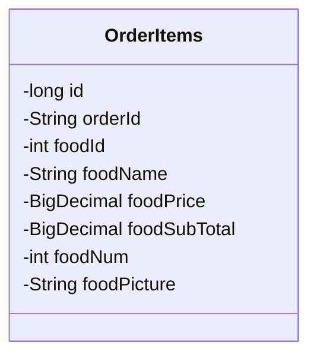

# 基础信息

|      |      |
|------|------|
| 编码语言 | .java |
| 代码路径 | boat-house-backend/src/product-service/api/src/main/java/com/idcf/boathouse/product/models/OrderItems.java |
| 包名 | com.idcf.boathouse.product.models |
| 依赖项 | ['com.baomidou.mybatisplus.annotation', 'lombok.Data', 'java.math.BigDecimal'] |
| 概述说明 | OrderItems类映射idcf_order_items表，包含订单项ID、订单ID、食品ID、名称、价格、数量、图片字段。 |

# 说明

OrderItems类映射到idcf_order_items表，包含多个关键字段，用于描述订单项信息。这些字段包括订单项ID，用于唯一标识每个订单项；订单ID，用于关联所属订单；食品ID，用于标识具体的食品；名称，表示食品的名称；价格，记录食品的单价；数量，表示订单中该食品的数量；图片，用于展示食品的视觉信息。这些字段共同构成了订单项的完整数据结构，便于系统管理和查询。

# 类列表 Class Summary

| 名称   | 类型  | 说明 |
|-------|------|-------------|
| OrderItems | class | OrderItems类映射idcf_order_items表，包含订单项ID、订单ID、食品ID、名称、价格、数量、图片等字段。 |

## 类 OrderItems

|      |      |
|------|------|
| 访问范围 | @Data;@TableName(value = "idcf_order_items");public |
| 类型 | class |
| 名称 | OrderItems |
| 说明 | OrderItems类映射idcf_order_items表，包含订单项ID、订单ID、食品ID、名称、价格、数量、图片等字段。 |

### UML类图

这段代码定义了一个名为 `OrderItems` 的类，用于表示订单中的商品项。类中包含多个私有字段，分别表示商品的唯一标识 `id`、订单编号 `orderId`、商品编号 `foodId`、商品名称 `foodName`、商品价格 `foodPrice`、商品小计 `foodSubTotal`、商品数量 `foodNum` 以及商品图片 `foodPicture`。这些字段通过注解与数据库表中的列进行映射，表明该类是一个与数据库表 `idcf_order_items` 对应的实体类。

### 内部方法调用关系图

```mermaid
graph TD
    A["类OrderItems"]
    B["注解: @TableName(value='idcf_order_items')"]
    C["属性: long id"]
    D["注解: @TableId(value='id', type=IdType.AUTO)"]
    E["属性: String orderId"]
    F["注解: @TableField(value='order_id', insertStrategy=FieldStrategy.DEFAULT)"]
    G["属性: int foodId"]
    H["注解: @TableField(value='food_id', insertStrategy=FieldStrategy.DEFAULT)"]
    I["属性: String foodName"]
    J["注解: @TableField(value='food_name', insertStrategy=FieldStrategy.DEFAULT)"]
    K["属性: BigDecimal foodPrice"]
    L["注解: @TableField(value='food_price', insertStrategy=FieldStrategy.DEFAULT)"]
    M["属性: BigDecimal foodSubTotal"]
    N["注解: @TableField(value='food_sub_total', insertStrategy=FieldStrategy.DEFAULT)"]
    O["属性: int foodNum"]
    P["注解: @TableField(value='food_num', insertStrategy=FieldStrategy.DEFAULT)"]
    Q["属性: String foodPicture"]
    R["注解: @TableField(value='food_picture', insertStrategy=FieldStrategy.DEFAULT)"]

    A --> B
    A --> C
    C --> D
    A --> E
    E --> F
    A --> G
    G --> H
    A --> I
    I --> J
    A --> K
    K --> L
    A --> M
    M --> N
    A --> O
    O --> P
    A --> Q
    Q --> R
```

这段代码定义了一个名为 `OrderItems` 的类，用于表示订单项信息。类中包含多个属性，如 `id`、`orderId`、`foodId` 等，每个属性都通过注解 `@TableField` 或 `@TableId` 进行映射，以便与数据库表 `idcf_order_items` 中的字段对应。类级别的注解 `@TableName` 指定了表名，而属性级别的注解则定义了字段的映射策略和类型。

### 字段列表 Field List

| 名称  | 类型  | 说明 |
|-------|-------|------|
| foodPicture | String | 实体类字段映射数据库表列，使用默认插入策略。 |
| foodSubTotal | BigDecimal | 字段foodSubTotal使用默认插入策略。 |
| foodNum | int | 字段foodNum使用默认插入策略。 |
| foodName | String | 实体类字段foodName映射数据库列food_name，采用默认插入策略。 |
| id | long | 表ID为id，类型为自增长整型。 |
| orderId | String | 定义私有字符串变量orderId，使用默认插入策略。 |
| foodId | int | 定义私有整型变量foodId，映射数据库字段food_id，使用默认插入策略。 |
| foodPrice | BigDecimal | 表字段“food_price”使用默认插入策略，类型为BigDecimal。 |

### 方法列表 Method List

| 名称  | 类型  | 说明 |
|-------|-------|------|

