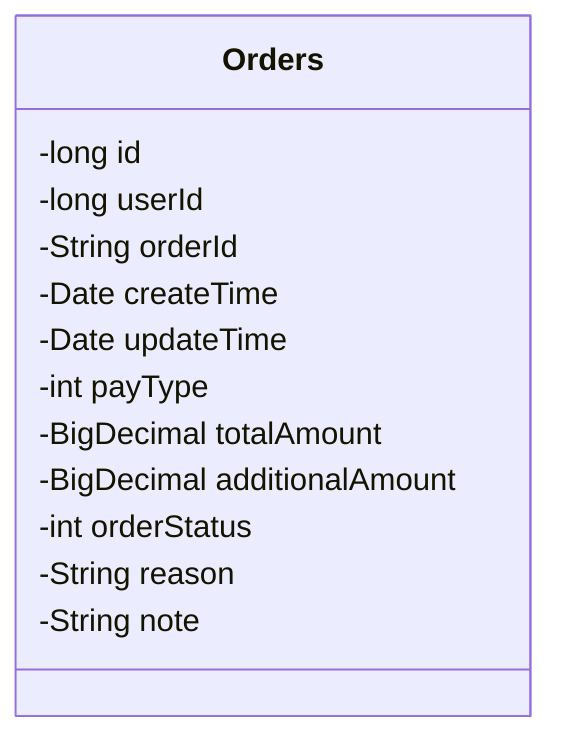

# 基础信息

|      |      |
|------|------|
| 编码语言 | .java |
| 代码路径 | boat-house-backend/src/product-service/api/src/main/java/com/idcf/boathouse/product/models/Orders.java |
| 包名 | com.idcf.boathouse.product.models |
| 依赖项 | ['com.baomidou.mybatisplus.annotation', 'lombok.Data', 'java.math.BigDecimal', 'java.util.Date'] |
| 概述说明 | Orders类映射idcf_orders表，含订单ID、用户ID、创建时间、支付类型等字段。 |

# 说明

Orders类是一个映射到idcf_orders表的实体类，用于表示订单信息。该类包含多个关键字段，包括订单ID、用户ID、创建时间和支付类型。这些字段分别用于唯一标识订单、关联用户、记录订单创建时间以及指定支付方式。通过该类，可以方便地管理和操作订单数据。

# 类列表 Class Summary

| 名称   | 类型  | 说明 |
|-------|------|-------------|
| Orders | class | Orders类映射idcf_orders表，包含订单ID、用户ID、创建时间、支付类型等字段。 |

## 类 Orders

|      |      |
|------|------|
| 访问范围 | @Data;@TableName(value = "idcf_orders");public |
| 类型 | class |
| 名称 | Orders |
| 说明 | Orders类映射idcf_orders表，包含订单ID、用户ID、创建时间、支付类型等字段。 |

### UML类图

这段代码定义了一个名为 `Orders` 的类，用于表示订单信息。类中包含多个私有字段，分别表示订单的唯一标识、用户ID、订单ID、创建时间、更新时间、支付类型、总金额、附加金额、订单状态、原因和备注。这些字段通过注解与数据库表中的列进行映射，确保数据持久化时的正确性。类图展示了类的结构及其字段，便于理解类的属性和用途。

### 内部方法调用关系图

```mermaid
graph TD
    A["类Orders"]
    B["注解: @TableName(value = 'idcf_orders')"]
    C["属性: long id"]
    D["注解: @TableId(value = 'id', type = IdType.AUTO)"]
    E["属性: long userId"]
    F["注解: @TableField(value = 'user_id', insertStrategy = FieldStrategy.DEFAULT)"]
    G["属性: String orderId"]
    H["注解: @TableField(value = 'order_id', insertStrategy = FieldStrategy.DEFAULT)"]
    I["属性: Date createTime"]
    J["注解: @TableField(value = 'create_time', insertStrategy = FieldStrategy.DEFAULT)"]
    K["属性: Date updateTime"]
    L["注解: @TableField(value = 'update_time', insertStrategy = FieldStrategy.DEFAULT)"]
    M["属性: int payType"]
    N["注解: @TableField(value = 'pay_type', insertStrategy = FieldStrategy.DEFAULT)"]
    O["属性: BigDecimal totalAmount"]
    P["注解: @TableField(value = 'total_amount', insertStrategy = FieldStrategy.DEFAULT)"]
    Q["属性: BigDecimal additionalAmount"]
    R["注解: @TableField(value = 'additional_amount', insertStrategy = FieldStrategy.DEFAULT)"]
    S["属性: int orderStatus"]
    T["注解: @TableField(value = 'order_status', insertStrategy = FieldStrategy.DEFAULT)"]
    U["属性: String reason"]
    V["注解: @TableField(value = 'reason', insertStrategy = FieldStrategy.DEFAULT)"]
    W["属性: String note"]
    X["注解: @TableField(value = 'note', insertStrategy = FieldStrategy.DEFAULT)"]

    A --> B
    A --> C
    C --> D
    A --> E
    E --> F
    A --> G
    G --> H
    A --> I
    I --> J
    A --> K
    K --> L
    A --> M
    M --> N
    A --> O
    O --> P
    A --> Q
    Q --> R
    A --> S
    S --> T
    A --> U
    U --> V
    A --> W
    W --> X
```

这段代码定义了一个名为 `Orders` 的类，用于表示订单信息。类中包含了多个属性，如 `id`、`userId`、`orderId` 等，每个属性都使用了 `@TableField` 注解来指定数据库表中的字段名称和插入策略。类本身使用了 `@TableName` 注解来指定对应的数据库表名。通过这些注解，代码实现了与数据库表的映射关系，便于进行数据操作。

### 字段列表 Field List

| 名称  | 类型  | 说明 |
|-------|-------|------|
| id | long | 表主键ID，自动递增类型。 |
| orderStatus | int | 实体类中定义订单状态字段，使用默认插入策略。 |
| totalAmount | BigDecimal | 实体类字段totalAmount使用默认插入策略。 |
| createTime | Date | 实体类字段createTime使用默认插入策略。 |
| reason | String | 实体类字段"reason"使用默认插入策略。 |
| additionalAmount | BigDecimal | 字段additionalAmount使用默认插入策略。 |
| userId | long | 代码定义了一个私有长整型变量userId，并指定其数据库字段名为user_id，插入策略为默认。 |
| payType | int | 实体类字段payType，映射数据库列pay_type，使用默认插入策略。 |
| updateTime | Date | 实体类中定义了一个更新时间字段，使用默认插入策略。 |
| orderId | String | 实体类中定义订单ID字段，采用默认插入策略。 |
| note | String | 表字段note，插入策略为默认。 |

### 方法列表 Method List

| 名称  | 类型  | 说明 |
|-------|-------|------|

