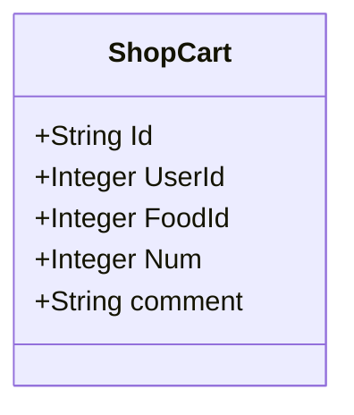
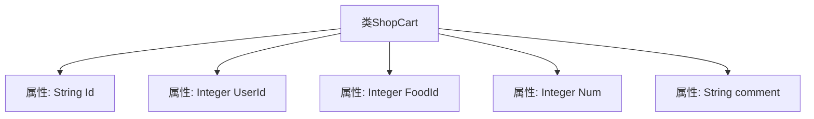

# 基础信息

|      |      |
|------|------|
| 编码语言 | .java |
| 代码路径 | boat-house-backend/src/product-service/api/src/main/java/com/idcf/boathouse/product/models/ShopCart.java |
| 包名 | com.idcf.boathouse.product.models |
| 依赖项 | ['io.swagger.annotations.ApiModel', 'io.swagger.annotations.ApiModelProperty', 'java.math.BigDecimal', 'java.sql.Blob'] |
| 概述说明 | 购物车类包含ID、用户ID、菜品ID、数量和描述字段。 |

# 说明

购物车类包含五个主要字段：ID用于唯一标识购物车实例，用户ID关联特定用户，菜品ID标识所选菜品，数量表示所选菜品的份数，描述字段用于记录购物车中菜品的附加信息或备注。这些字段共同构成了购物车的基本数据结构，确保用户能够有效地管理和跟踪其订单内容。

# 类列表 Class Summary

| 名称   | 类型  | 说明 |
|-------|------|-------------|
| ShopCart | class | 购物车类包含ID、用户ID、菜品ID、数量和描述字段。 |

## 类 ShopCart

|      |      |
|------|------|
| 访问范围 | @ApiModel;public |
| 类型 | class |
| 名称 | ShopCart |
| 说明 | 购物车类包含ID、用户ID、菜品ID、数量和描述字段。 |

### UML类图

类图描述：  
`ShopCart` 类表示一个购物车实体，包含购物车的唯一标识 `Id`、用户标识 `UserId`、菜品标识 `FoodId`、菜品数量 `Num` 以及购物车描述 `comment`。这些属性均为公有成员，用于存储购物车的基本信息。该类主要用于在系统中管理购物车的数据。

### 内部方法调用关系图

这段代码定义了一个名为`ShopCart`的类，用于表示购物车的信息。该类包含五个属性：`Id`（购物车ID）、`UserId`（用户ID）、`FoodId`（菜品ID）、`Num`（菜品数量）和`comment`（购物车描述）。每个属性都使用了`@ApiModelProperty`注解来提供属性的描述信息。这个类主要用于存储和传递购物车相关的数据。

### 字段列表 Field List

| 名称  | 类型  | 说明 |
|-------|-------|------|
| UserId | Integer | 用户ID属性，类型为整数。 |
| Id | String | 购物车ID字段定义。 |
| comment | String | 购物车描述字段。 |
| Num | Integer | 菜品数量字段定义为整数类型。 |
| FoodId | Integer | 菜品ID属性，用于标识菜品。 |

### 方法列表 Method List

| 名称  | 类型  | 说明 |
|-------|-------|------|

