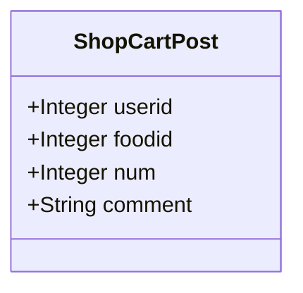
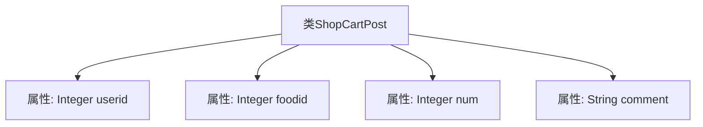

# 基础信息

|      |      |
|------|------|
| 编码语言 | .java |
| 代码路径 | boat-house-backend/src/product-service/api/src/main/java/com/idcf/boathouse/product/models/ShopCartPost.java |
| 包名 | com.idcf.boathouse.product.models |
| 依赖项 | ['io.swagger.annotations.ApiModelProperty', 'java.math.BigDecimal'] |
| 概述说明 | ShopCartPost类含用户ID、食品ID、数量和评论字段。 |

# 说明

ShopCartPost类是一个用于表示购物车信息的类，包含四个主要字段：用户ID、食品ID、数量和评论。用户ID用于标识购物车所属的用户，食品ID用于标识购物车中的具体食品，数量表示该食品的购买数量，评论字段则允许用户对该食品进行评价或备注。这些字段共同构成了购物车的基本信息结构，便于系统管理和用户操作。

# 类列表 Class Summary

| 名称   | 类型  | 说明 |
|-------|------|-------------|
| ShopCartPost | class | ShopCartPost类包含用户ID、食品ID、数量和评论字段。 |

## 类 ShopCartPost

|      |      |
|------|------|
| 访问范围 | public |
| 类型 | class |
| 名称 | ShopCartPost |
| 说明 | ShopCartPost类包含用户ID、食品ID、数量和评论字段。 |

### UML类图

这段代码定义了一个名为 `ShopCartPost` 的类，用于表示购物车中的商品信息。该类包含四个公有成员变量：`userid`（用户ID）、`foodid`（食品ID）、`num`（数量）和 `comment`（评论）。这些成员变量用于存储与购物车商品相关的数据，方便后续处理和操作。

### 内部方法调用关系图

这段代码定义了一个名为 `ShopCartPost` 的类，该类包含四个属性：`userid`、`foodid`、`num` 和 `comment`。这些属性分别用于存储用户ID、食品ID、数量以及评论信息。该类的结构简单，主要用于表示购物车中的某一项数据。通过这四个属性，可以完整地描述用户在购物车中选择的食品及其相关信息。

### 字段列表 Field List

| 名称  | 类型  | 说明 |
|-------|-------|------|
| comment | String | 定义一个字符串类型的公共变量comment。 |
| foodid | Integer | 定义了一个名为foodid的公共整数变量。 |
| userid | Integer | 定义一个名为userid的公共整型变量。 |
| num | Integer | 定义一个公共整型变量num。 |

### 方法列表 Method List

| 名称  | 类型  | 说明 |
|-------|-------|------|

