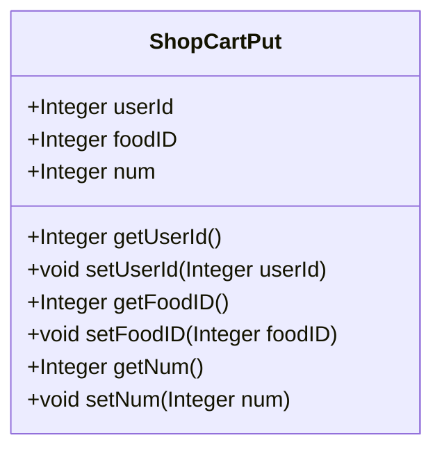
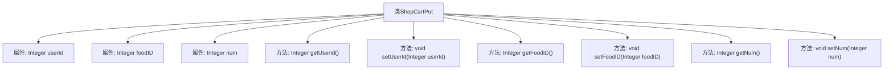

# 基础信息

|      |      |
|------|------|
| 编码语言 | .java |
| 代码路径 | boat-house-backend/src/product-service/api/src/main/java/com/idcf/boathouse/product/models/ShopCartPut.java |
| 包名 | com.idcf.boathouse.product.models |
| 依赖项 | [] |
| 概述说明 | ShopCartPut类包含用户ID、食品ID和数量，提供getter和setter方法。 |

# 说明

ShopCartPut类是一个用于管理购物车操作的类，主要包含三个关键属性：用户ID、食品ID和数量。该类提供了相应的getter和setter方法，以便于对这些属性进行读取和修改。用户ID用于标识操作购物车的用户，食品ID用于指定购物车中的具体食品，数量则表示该食品在购物车中的数量。通过这些方法，可以方便地对购物车中的商品进行管理和更新。

# 类列表 Class Summary

| 名称   | 类型  | 说明 |
|-------|------|-------------|
| ShopCartPut | class | ShopCartPut类包含用户ID、食品ID和数量，提供getter和setter方法。 |

## 类 ShopCartPut

|      |      |
|------|------|
| 访问范围 | public |
| 类型 | class |
| 名称 | ShopCartPut |
| 说明 | ShopCartPut类包含用户ID、食品ID和数量，提供getter和setter方法。 |

### UML类图

### 描述
`ShopCartPut` 类是一个用于表示购物车中商品信息的简单类。它包含三个公有属性：`userId`、`foodID` 和 `num`，分别表示用户ID、食品ID和商品数量。类中提供了相应的getter和setter方法，用于获取和设置这些属性的值。该类主要用于在购物车系统中存储和操作商品信息。

### 内部方法调用关系图

这段代码定义了一个名为 `ShopCartPut` 的类，包含三个属性：`userId`、`foodID` 和 `num`，并分别为这些属性提供了 `get` 和 `set` 方法。这些方法用于获取和设置属性的值。类的主要作用是封装购物车中商品的用户ID、食品ID和数量信息，并通过方法提供对这些信息的访问和修改。

### 字段列表 Field List

| 名称  | 类型  | 说明 |
|-------|-------|------|
| userId | Integer | 用户ID为整型变量。 |
| num | Integer | 定义一个名为num的公共整数变量。 |
| foodID | Integer | 定义整型变量foodID。 |

### 方法列表 Method List

| 名称  | 类型  | 说明 |
|-------|-------|------|
| getNum | Integer | 获取整数类型变量num的值。 |
| setFoodID | void | 设置食物ID的方法。 |
| getFoodID | Integer | 获取食物ID的公共方法。 |
| setNum | void | 该方法用于设置类中的整数变量num的值。 |
| setUserId | void | 设置用户ID的方法，将传入的整数值赋给类的userId属性。 |
| getUserId | Integer | 获取用户ID的方法。 |

