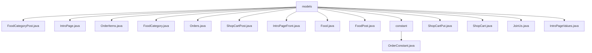

# 基础信息

|      |      |
|------|------|
| 编码语言 | .java |
| 代码路径 | boat-house-backend/src/product-service/api/src/main/java/com/idcf/boathouse/product/models |
| 包名 | boat-house-backend.src.product-service.api.src.main.java.com.idcf.boathouse.product.models |
| 概述说明 | 各类包含ID、名称、描述等属性，用于管理和展示食品、订单、购物车等信息。 |

# 说明

FoodCategoryPost类包含id、name和description属性，用于唯一标识和描述食品类别。IntroPage类映射到intropage表，包含页面ID、标题、API地址、文本、图片、删除状态、创建时间和更新时间字段，管理页面信息。OrderItems类映射到idcf_order_items表，包含订单项ID、订单ID、食品ID、名称、价格、数量和图片字段，描述订单项信息。FoodCategory类包含菜品分类ID、名称和描述属性，表示菜品分类信息。Orders类映射到idcf_orders表，包含订单ID、用户ID、创建时间和支付类型字段，表示订单信息。ShopCartPost类包含用户ID、食品ID、数量和评论字段，表示购物车信息。介绍页类包含ID、标题、后台调用地址和内容图片信息，管理介绍页数据。Food类包含菜品ID、分类ID、名称、价格、描述和图片属性，表示菜品信息。FoodPost类包含ID、名称、分类ID、价格、描述和图片字段，存储食物信息。OrderConstant类定义订单状态映射关系，提供获取状态描述的方法。ShopCartPut类包含用户ID、食品ID和数量属性，管理购物车操作。购物车类包含ID、用户ID、菜品ID、数量和描述字段，管理购物车数据。JoinUs类包含id、name、telephone和comment字段，存储相关信息。介绍页API模型类包含文字内容和图片地址字段，展示介绍页信息。

### 包内部结构视图

该流程图展示了`models`目录下的文件结构，`models`作为根节点，包含了多个Java类文件和一个子目录`constant`。`constant`目录下又包含`OrderConstant.java`文件。所有节点仅显示路径的最后一级元素，清晰地展示了文件之间的层级关系。

# 文件列表 File List

| 名称   | 类型  | 说明 |
|-------|------|-------------|
| [IntroPageValues.java](IntroPageValues.md) | file | API模型类包含文字内容和图片地址的介绍页。 |
| [JoinUs.java](JoinUs.md) | file | JoinUs类包含id、name、telephone和comment字段，id自动生成。 |
| [ShopCart.java](ShopCart.md) | file | 购物车类包含ID、用户ID、菜品ID、数量和描述字段。 |
| [ShopCartPut.java](ShopCartPut.md) | file | ShopCartPut类包含用户ID、食品ID和数量，提供getter和setter方法。 |
| [FoodPost.java](FoodPost.md) | file | FoodPost类包含ID、名称、分类ID、价格、描述和图片字段。 |
| [Food.java](Food.md) | file | Food类包含菜品ID、分类ID、名称、价格、描述和图片属性。 |
| [IntroPageFront.java](IntroPageFront.md) | file | 介绍页包含ID、标题、后台调用地址及图片信息。 |
| [ShopCartPost.java](ShopCartPost.md) | file | ShopCartPost类含用户ID、食品ID、数量和评论字段。 |
| [Orders.java](Orders.md) | file | Orders类映射idcf_orders表，含订单ID、用户ID、创建时间、支付类型等字段。 |
| [FoodCategory.java](FoodCategory.md) | file | FoodCategory类包含菜品分类ID、名称和描述。 |
| [OrderItems.java](OrderItems.md) | file | OrderItems类映射idcf_order_items表，包含订单项ID、订单ID、食品ID、名称、价格、数量、图片字段。 |
| [IntroPage.java](IntroPage.md) | file | IntroPage类映射intropage表，含页面ID、标题、API地址、文本、图片、删除状态及创建更新时间字段。 |
| [FoodCategoryPost.java](FoodCategoryPost.md) | file | FoodCategoryPost类包含id、名称和描述三个属性。 |
| [constant](constant/_module.md) | package | OrderConstant类定义订单状态映射及状态描述功能。 |

