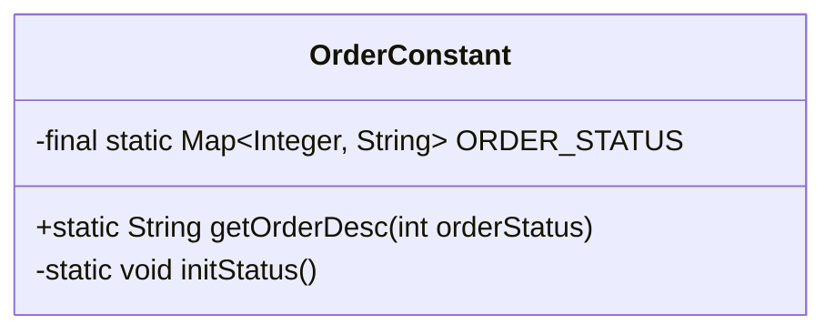
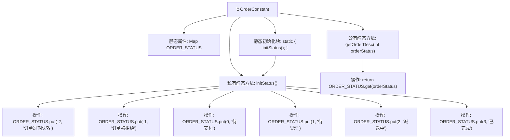

# 基础信息

|      |      |
|------|------|
| 编码语言 | .java |
| 代码路径 | boat-house-backend/src/product-service/api/src/main/java/com/idcf/boathouse/product/models/constant/OrderConstant.java |
| 包名 | com.idcf.boathouse.product.models.constant |
| 依赖项 | ['java.util.HashMap', 'java.util.Map'] |
| 概述说明 | OrderConstant类定义订单状态映射及状态描述功能。 |

# 说明

OrderConstant类用于定义订单状态的映射关系，并提供一个方法用于获取订单状态的描述。该类的主要功能是将订单状态与其对应的描述信息关联起来，便于在系统中统一管理和使用订单状态信息。通过此类，可以方便地查询和获取订单状态的详细描述，确保订单状态在系统中的一致性和可读性。

# 类列表 Class Summary

| 名称   | 类型  | 说明 |
|-------|------|-------------|
| OrderConstant | class | OrderConstant类定义订单状态映射并提供状态描述方法。 |

## 类 OrderConstant

|      |      |
|------|------|
| 访问范围 | public final |
| 类型 | class |
| 名称 | OrderConstant |
| 说明 | OrderConstant类定义订单状态映射并提供状态描述方法。 |

### UML类图

类图描述：`OrderConstant` 类是一个不可变的工具类，用于管理订单状态的描述信息。它包含一个静态的 `Map` 成员 `ORDER_STATUS`，用于存储订单状态码与描述信息的映射关系。类中定义了一个静态初始化块 `initStatus`，用于初始化 `ORDER_STATUS` 的键值对。`getOrderDesc` 方法用于根据订单状态码获取对应的描述信息。该类的主要作用是提供订单状态的查询功能，且状态信息在类加载时就已经初始化完成。

### 内部方法调用关系图

该流程图描述了`OrderConstant`类的结构及其内部方法调用关系。类中包含一个静态的`ORDER_STATUS`映射，用于存储订单状态及其描述。静态初始化块在类加载时调用`initStatus()`方法，初始化订单状态映射。`getOrderDesc`方法根据传入的订单状态码返回对应的描述。整个流程展示了类的初始化过程以及方法的调用顺序。

### 字段列表 Field List

| 名称  | 类型  | 说明 |
|-------|-------|------|
| ORDER_STATUS = new HashMap<>() | Map<Integer, String> | 定义了一个静态不可变的订单状态映射。 |

### 方法列表 Method List

| 名称  | 类型  | 说明 |
|-------|-------|------|
| getOrderDesc | String | 静态方法获取订单状态描述。 |
| initStatus | void | 初始化订单状态映射，包含过期、拒绝、待支付等状态。 |

